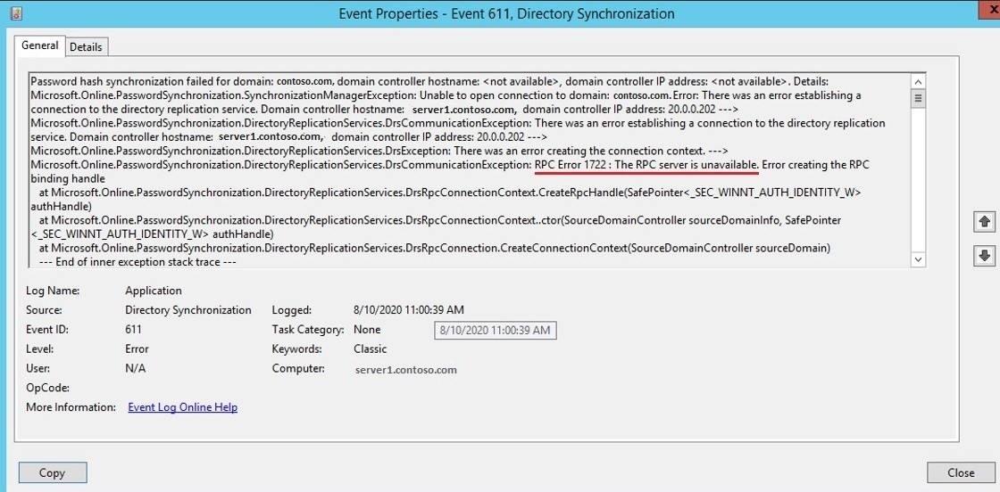
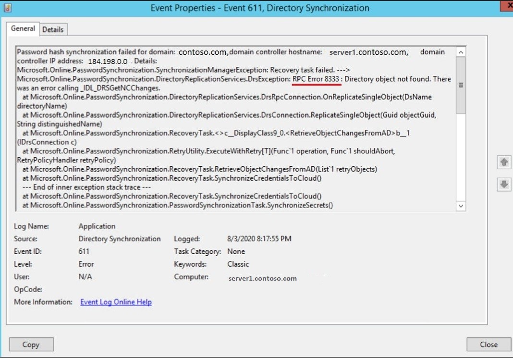
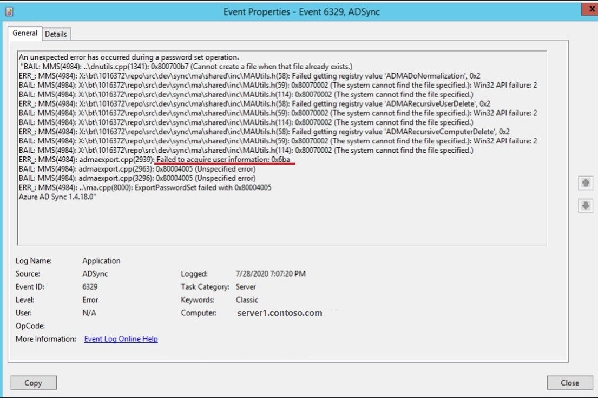

# RPC errors affecting AADConnect

Customers may experience issues where they cannot configure AADConnect and or enable features due to Remote Procedure Call (RPC) related errors.

Customers may also experience features previously enabled stop working due to these types of errors.  

In the vast majority of cases, the issue is affecting AADConnect and not caused by AADConnect, so finding the exact underlying problem is crucial to correctly define troubleshooting steps and identify the right underlying issue causing the errors.

This article cover examples of AADConnect features affected by RPC errors.

## Investigating a Remote Procedure Call error affecting AADConnect

When an issue is identified, it is generally recommended as part of troubleshooting initial steps, to carefully investigate Application events using Event Viewer. Determining the system error being returned from the remote procedure call will help you target your investigation and define the right troubleshooting methods and tools.

For these types of errors, Application events include information about the RPC error such as in the following examples:

### Example 1



Snippet from the Application error event seen in the previous image:

    Log Name:      Application
    Source:        Directory Synchronization
    Date:          8/10/2020 11:00:39 AM
    Event ID:      611
    Task Category: None
    Level:         Error
    Keywords:      Classic
    User:          N/A
    Computer:      server1.contoso.com
    Description:
    Password hash synchronization failed for domain: riantu.local, domain controller hostname: <not available>, domain controller IP address: <not available>. Details: 
    Microsoft.Online.PasswordSynchronization.SynchronizationManagerException: Unable to open connection to domain: contoso.com. Error: There was an error establishing a connection to the directory replication service. Domain  
    controller hostname: server1.contoso.com, domain controller IP address: 20.0.0.202 ---> Microsoft.Online.PasswordSynchronization.DirectoryReplicationServices.DrsCommunicationException: There was an error establishing a  
    connection to the directory replication service. Domain controller hostname: server1.contoso.com, domain controller IP address: 20.0.0.202 ---> Microsoft.Online.PasswordSynchronization.DirectoryReplicationServices.  
    DrsException: There was an error creating the connection context. ---> Microsoft.Online.PasswordSynchronization.DirectoryReplicationServices.DrsCommunicationException: RPC Error 1722 : The RPC server is unavailable. Error  
    creating the RPC binding handle

In this case, the RPC communication failed with error **"1722 : The RPC server is unavailable"**.

[System Error Codes 1700-3999](https://docs.microsoft.com/windows/win32/debug/system-error-codes--1700-3999-)

In this example, the error is affecting AADConnect password synchronization feature.

### Troubleshooting Example 1

The error in Example 1 is a common networking related error for which troubleshooting steps can be found in [Troubleshoot TCP/IP RPC Errors](https://docs.microsoft.com/windows/client-management/troubleshoot-tcpip-rpc-errors).

In this scenario, investigating a network trace reveals retransmit packets being sent for communication with destination **port 135**, so traffic on this port is being blocked on the destination server.


These errors can manifest intermittently, which adds complexity to the process of collecting data, like a network trace, for investigation and troubleshooting.

The following steps allow to automatically collect a network trace, when the error event id is generated.

> [!NOTE]
> To automatically collect an network trace, **Microsoft Network Monitor** must be installed on the AADConnect server.
>
> [Download Netmon](https://www.microsoft.com/download/details.aspx?id=4865)

1. From an elevated command prompt, run the following command:

   ```dos
   nmcap /network * /Capture /file c:\MSData\%Computername%_Trace.cap:500M /StopWhen /Frame (ICMP and Ipv4.TotalLength == 328) /CaptureProcesses /TimeAfter 2s
   ```

2. To stop the trace when the error is generated, send a Ping with the correct size.

   Prepare the Ping Command in a script (cmd file for instance) that you execute when the AADConnect throws the Error in Event log.

   Ping command:

   ```dos
   ping -l 300 -n 2 1.2.3.4
   ```

3. Attach a task that runs the cmd file created in the previous step to the event that is generated when the issue reproduces. That will trigger the ping command that stops the trace.

   

### Example 2

   

Snippet from the Application error event seen in the previous image:

    Log Name:      Application
    Source:        Directory Synchronization
    Date:          8/3/2020 8:17:55 PM
    Event ID:      611
    Task Category: None
    Level:         Error
    Keywords:      Classic
    User:          N/A
    Computer:      server1.contoso.com
    Description:
    Password hash synchronization failed for domain: contoso.com, domain controller hostname: server1.contoso.com, domain controller IP address: 184.198.0.0. Details: 
    Microsoft.Online.PasswordSynchronization.SynchronizationManagerException: Recovery task failed. ---> Microsoft.Online.PasswordSynchronization.DirectoryReplicationServices.DrsException: RPC Error 8333 : Directory object not found. There was an error calling _IDL_DRSGetNCChanges.

Other infrastructure configuration issues may contribute to Remote Procedure Call problems, such as DNS name resolution, Authentication problems, etc.

It’s important to note the error number for appropriate investigation and troubleshooting.

### Troubleshooting Example 2

In Example 2 the Remote Procedure Call returned error is **833**, an error for **"Directory object not found"**

[System Error Codes 8200-8999](https://docs.microsoft.com/windows/win32/debug/system-error-codes--8200-8999-)

AADConnect server was not able to find the user object for which it is trying to perform Password Hash Synchronization in Active Directory.

More detailed information and troubleshooting guidance can be found in [Windows Server Troubleshooting : RPC Server is unavailable](https://social.technet.microsoft.com/wiki/contents/articles/4494.windows-server-troubleshooting-rpc-server-is-unavailable.aspx).

### Example 3



Snippet from the Application error event seen in the previous image:

    Log Name:      Application
    Source:        ADSync
    Date:          7/28/2020 7:07:20 PM
    Event ID:      6329
    Task Category: Server
    Level:         Error
    Keywords:      Classic
    User:          N/A
    Computer:      server1.contoso.com
    Description:
    An unexpected error has occurred during a password set operation. 
    "BAIL: MMS(4984): ..\dnutils.cpp(1341): 0x800700b7 (Cannot create a file when that file already exists.)
    ERR_: MMS(4984): X:\bt\1016372\repo\src\dev\sync\ma\shared\inc\MAUtils.h(58): Failed getting registry value 'ADMADoNormalization', 0x2
    BAIL: MMS(4984): X:\bt\1016372\repo\src\dev\sync\ma\shared\inc\MAUtils.h(59): 0x80070002 (The system cannot find the file specified.): Win32 API failure: 2
    BAIL: MMS(4984): X:\bt\1016372\repo\src\dev\sync\ma\shared\inc\MAUtils.h(114): 0x80070002 (The system cannot find the file specified.)
    ERR_: MMS(4984): X:\bt\1016372\repo\src\dev\sync\ma\shared\inc\MAUtils.h(58): Failed getting registry value 'ADMARecursiveUserDelete', 0x2
    BAIL: MMS(4984): X:\bt\1016372\repo\src\dev\sync\ma\shared\inc\MAUtils.h(59): 0x80070002 (The system cannot find the file specified.): Win32 API failure: 2
    BAIL: MMS(4984): X:\bt\1016372\repo\src\dev\sync\ma\shared\inc\MAUtils.h(114): 0x80070002 (The system cannot find the file specified.)
    ERR_: MMS(4984): X:\bt\1016372\repo\src\dev\sync\ma\shared\inc\MAUtils.h(58): Failed getting registry value 'ADMARecursiveComputerDelete', 0x2
    BAIL: MMS(4984): X:\bt\1016372\repo\src\dev\sync\ma\shared\inc\MAUtils.h(59): 0x80070002 (The system cannot find the file specified.): Win32 API failure: 2
    BAIL: MMS(4984): X:\bt\1016372\repo\src\dev\sync\ma\shared\inc\MAUtils.h(114): 0x80070002 (The system cannot find the file specified.)
    ERR_: MMS(4984): admaexport.cpp(2939): Failed to acquire user information: 0x6ba
    BAIL: MMS(4984): admaexport.cpp(2963): 0x80004005 (Unspecified error)
    BAIL: MMS(4984): admaexport.cpp(3296): 0x80004005 (Unspecified error)
    ERR_: MMS(4984): ..\ma.cpp(8000): ExportPasswordSet failed with 0x80004005
    Azure AD Sync 1.4.18.0"

It’s important to know that errors can be represented in their hexadecimal code, like in this example.

You can also use the hexadecimal error code to search the error symbolic name.

The error **"0x6ba"** translates to an **"RPC Server Unavailable" error 1722**. The troubleshooting steps used in **Example 1** also apply here.

[System Error Codes 1700-3999](https://docs.microsoft.com/windows/win32/debug/system-error-codes--1700-3999-)

### Example 4

Another example with the RPC error represented in its hexadecimal form:


In this case, the error returned **"0x5"** translates to an access denied error:

[System Error Codes 0-499](https://docs.microsoft.com/windows/win32/debug/system-error-codes--0-499-)  

There may be various reasons to raise an access denied error. Hardening group policies implemented in Active Directory is one of them. One example is restricting clients allowed to make calls to SAM:

[Network access: Restrict clients allowed to make remote calls to SAM](https://docs.microsoft.com/windows/security/threat-protection/security-policy-settings/network-access-restrict-clients-allowed-to-make-remote-sam-calls)  

## Other commonly found system error codes returned in Remote Procedure Call affecting AADConnect

| Error ID | Hexadecimal error representation | Error symbolic name | Error descriptive text
|:-----------:|:-----------:|:-----------:|:-----------:|  
| [1127](https://docs.microsoft.com/windows/win32/debug/system-error-codes--1000-1299-) | 0x467 | ERROR_DISK_OPERATION_FAILED  |  While accessing the hard disk, a disk operation failed even after retries. |
| [1130](https://docs.microsoft.com/windows/win32/debug/system-error-codes--1000-1299-) | 0x46A | ERROR_NOT_ENOUGH_SERVER_MEMORY | Not enough server storage is available to process this command. |
| [1331](https://docs.microsoft.com/windows/win32/debug/system-error-codes--1300-1699-) | 0x533 | ERROR_ACCOUNT_DISABLED | This user can't sign in because this account is currently disabled. |
| [14](https://docs.microsoft.com/windows/win32/debug/system-error-codes--0-499-) | 0xE | ERROR_OUTOFMEMORY | Not enough storage is available to complete this operation. |
| [1450](https://docs.microsoft.com/windows/win32/debug/system-error-codes--1300-1699-) | 0x5AA | ERROR_NO_SYSTEM_RESOURCES | Insufficient system resources exist to complete the requested service. |
| [1722](https://docs.microsoft.com/windows/win32/debug/system-error-codes--1700-3999-) | 0x6BA | RPC_S_SERVER_UNAVAILABLE | The RPC server is unavailable. |
| [1723](https://docs.microsoft.com/windows/win32/debug/system-error-codes--1700-3999-) | 0x6BB | RPC_S_SERVER_TOO_BUSY | The RPC server is too busy to complete this operation. |
| [1726](https://docs.microsoft.com/windows/win32/debug/system-error-codes--1700-3999-) | 0x6BE | RPC_S_CALL_FAILED | The remote procedure call failed. |
| [1727](https://docs.microsoft.com/windows/win32/debug/system-error-codes--1700-3999-) | 0x6BF | RPC_S_CALL_FAILED_DNE | The remote procedure call failed and did not execute. |
| [1728](https://docs.microsoft.com/windows/win32/debug/system-error-codes--1700-3999-) | 0x6C0 | RPC_S_PROTOCOL_ERROR | A remote procedure call (RPC) protocol error occurred. |
| [1753](https://docs.microsoft.com/windows/win32/debug/system-error-codes--1700-3999-) | 0x6D9 | EPT_S_NOT_REGISTERED | There are no more endpoints available from the endpoint mapper. |
| [1818](https://docs.microsoft.com/windows/win32/debug/system-error-codes--1700-3999-)| 0x71A| RPC_S_CALL_CANCELLED | The remote procedure call was cancelled.|
| [1825](https://docs.microsoft.com/windows/win32/debug/system-error-codes--1700-3999-) | 0x721 | RPC_S_SEC_PKG_ERROR | A security package specific error occurred. |
| [5](https://docs.microsoft.com/windows/win32/debug/system-error-codes--0-499-) | 0x5 | ERROR_ACCESS_DENIED| Access is denied. |
| [6](https://docs.microsoft.com/windows/win32/debug/system-error-codes--0-499-) | 0x6 | ERROR_INVALID_HANDLE | The handle is invalid. |
| [8333](https://docs.microsoft.com/windows/win32/debug/system-error-codes--8200-8999-) | 0x208D | ERROR_DS_OBJ_NOT_FOUND | Directory object not found. |
| [8420](https://docs.microsoft.com/windows/win32/debug/system-error-codes--8200-8999-) | 0x20E4 | ERROR_DS_CANT_FIND_EXPECTED_NC | The naming context could not be found. |
| [8439](https://docs.microsoft.com/windows/win32/debug/system-error-codes--8200-8999-) | 0x20F7 | ERROR_DS_DRA_BAD_DN | The distinguished name specified for this replication operation is invalid. |
| [8446](https://docs.microsoft.com/windows/win32/debug/system-error-codes--8200-8999-) | 0x20FE | ERROR_DS_DRA_OUT_OF_MEM | The replication operation failed to allocate memory. |
| [8451](https://docs.microsoft.com/windows/win32/debug/system-error-codes--8200-8999-) | 0x2103 | ERROR_DS_DRA_DB_ERROR | The replication operation encountered a database error. |
| [8453](https://docs.microsoft.com/windows/win32/debug/system-error-codes--8200-8999-) | 0x2105 | ERROR_DS_DRA_ACCESS_DENIED | Replication access was denied. |
| [8456](https://docs.microsoft.com/windows/win32/debug/system-error-codes--8200-8999-) | 0x2108 | ERROR_DS_DRA_SOURCE_DISABLED | The source server is currently rejecting replication requests. |
| [8465](https://docs.microsoft.com/windows/win32/debug/system-error-codes--8200-8999-) | 0x2111 | ERROR_DS_DRA_SOURCE_IS_PARTIAL_REPLICA | The replication synchronization attempt failed because a master replica attempted to sync from a partial replica. |

## More information

System Error codes can be found through [Error Codes]](https://docs.microsoft.com/windows/win32/debug/system-error-codes)
