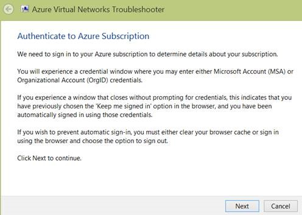
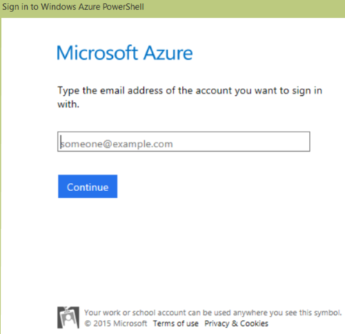
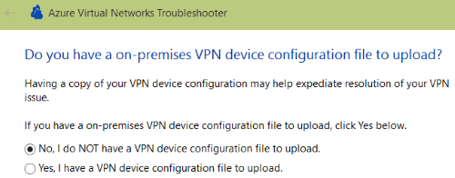
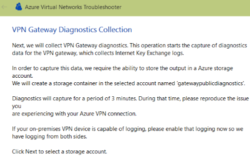
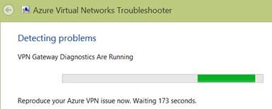
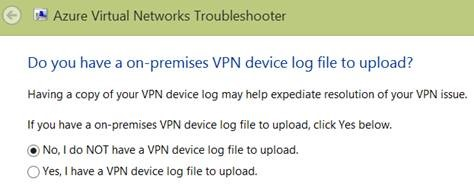

# [SDP3][fdcb6045-5616-45b4-bb68-0bd11081c184] Microsoft Azure Virtual Network Troubleshooter package

_Original product version:_ &nbsp; Virtual Network  
_Original KB number:_ &nbsp; 2996010

### Self-help

Click [here](https://home.diagnostics.support.microsoft.com/selfhelp?knowledgebasearticlefilter=2996010)  to run the Microsoft Azure Virtual Network troubleshooter from the self-help portal.

## Summary

This article describes how to troubleshoot issues with Microsoft Azure virtual networks by using a troubleshooter package. This diagnostic package takes advantage of the capabilities of the Azure PowerShell module and Azure Virtual Network representational state transfer (REST) APIs to perform the following tasks:
- Identify both the Azure virtual network (VNET) and the local network experiencing the VPN issue - List only Azure VNETs that have gateways, and we show only local network connections that are specific to the selected Azure VNET. If the customer selects a VNET that has no local network connection, or if the customer has no VNETS that have gateways, the diagnostic provides the customer with links to relevant documentation.
- Network configuration XML parsing - Parses the network configuration XML and includes it in a report in order to make it easier to understand and summarize customers' configurations.
- Azure Gateway Diagnostics - Similar to [the tool we recently released for public download](https://gallery.technet.microsoft.com/scriptcenter/azure-virtual-network-2b4d0793), the diagnostic package creates a three-minute Azure Gateway diagnostic file and asks the customer to turn on logging on the on-premises device and to reproduce the issue that he or she is experiencing.
- On-premises device configuration file and logging file - Prompts the customer to provide us with the device configuration and log file (after we ask the customer to reproduce the VPN issue).
- Virtual Network features configuration data collection :
  - Network Security Group (NSG)
  - Static IP (VNet and public)
  - Instance-level public IP (PIP)
  - ExpressRouteDNS (VNet, instance, and subnet level)

### Package information

A supported package is now available from Microsoft Support. To obtain the Microsoft Azure Virtual Network Troubleshooter package, use one of the following methods:
- Run the package from self-help portal  

To do this, go to the following Support Diagnostics website:

[Microsoft Azure Virtual Network Troubleshooter](https://home.diagnostics.support.microsoft.com/selfhelp?knowledgebasearticlefilter=2996010) 

- Submit a request to Microsoft Online Customer Services 

To do this, go to the following Microsoft Support website:

[https://go.microsoft.com/?linkid=6294451](https://go.microsoft.com/?linkid=6294451) 

> [!NOTE]
> If additional issues occur, or if any troubleshooting is required, you might have to create a separate service request. The usual support costs will apply to additional support questions and to issues that do not qualify for this specific package. To create a separate service request, go to the following Microsoft website:

[https://support.microsoft.com/contactus/?ws=support](/contactus/?ws=support) 

## More information

#### Information that is collected

- Network configuration XML

- On-premises VPN device configuration

- On-premises VPN device log

- Azure Gateway diagnostics log

- Azure Gateway connection statistics

#### Execution details

The following steps and screenshots provide a walk-through of the diagnostic package:
1. Provide your credentials to authenticate to the affected Azure subscription.

2. Confirm the Azure subscription name.

3. Select the scenario that best fits the issue that is being experienced.

4. Select the affected Azure virtual network.

5. Select a local network.

6. Respond to the prompt for an on-premises device configuration file.

7. Notify the customer about Azure Gateway diagnostics collection.

8. Respond to the prompt for storage account selection.

9. Display information that shows that the diagnostics are currently running, and ask the customer to reproduce the VPN issue.
(Seconds count down on the screen.)

10. Respond to the prompt for an on-premises device log file.

