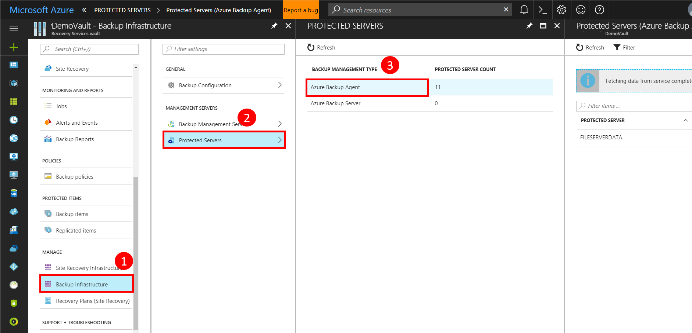
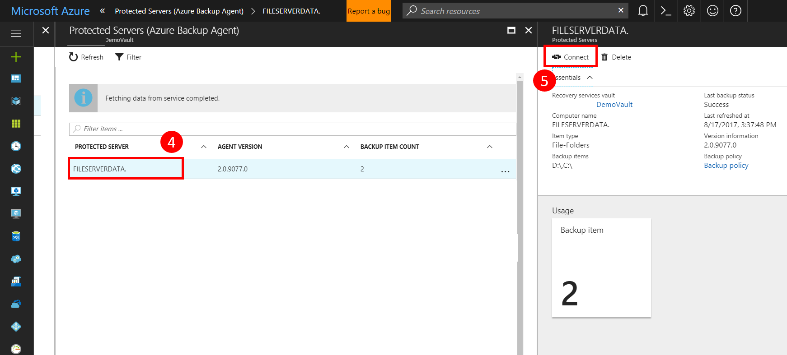

# Mandatory update for Microsoft Azure Recovery Services Agent: April 2018

This article describes an important update, new features, improvements, and fixes for Azure Backup for Microsoft Azure Recovery Services (MARS) Agent version 2.0.9118.0. This update is used by Microsoft Azure Backup and Microsoft Azure Site Recovery (ASR) for transferring data to Azure.

_Original product version:_ &nbsp; Azure Site Recovery  
_Original KB number:_ &nbsp; 4095462

## Important update

If you currently use an earlier version than 2.0.9083.0 of the Microsoft Azure Recovery Services (MARS) agent, also known as the Azure Backup agent, you must immediately download this update, install it, and then re-register the server that has Azure Backup. This is required to avoid backup and recovery failures that are caused by the deprecation of Access Control Services (ACS).

For more information about how to identify servers that have earlier versions of MARS agent in your environment, and the steps to update those servers, see the [Updating Azure Backup agents](https://docs.microsoft.com/archive/blogs/srinathv/updating-azure-backup-agents).

## New features

### Offline Backup support for CSP subscriptions and ARM Storage Accounts

The MARS Agent Offline Backup workflow now supports Azure Resource Manager Storage Accounts and subscriptions. These are used for initial offline seeding of large file-folder backup data to Azure through the new Azure portal-based Azure Import Service, and they provide the following benefits: 

- Cloud Solution Provider friendly
    In this update, the MARS Agent (stand-alone) can now be used by Cloud Solution Providers (CSP) to seed backup data to Azure by using disks without the need to create any classic resources such as non-CSP Subscriptions, Classic Storage Accounts or Classic Azure Import Jobs.
- Central monitoring and management of Azure Import Jobs
    Customers of MARS Agent-based offline backup can now move to the new Azure portal to monitor and track automatically created Azure Resource Manager Import Jobs from a single Import/Export Jobs page in the Azure portal, and update shipping details directly from the portal.
- More secure access to Azure Resources
    Azure Backup’s new workflow for Offline Backup eliminates the need for the Classic Azure Publish Settings file, uses secure Azure logon during the workflow, and uses an Azure Active Directory (Azure AD) application to provide secure and scoped access to the Azure Import Service.

    > [!NOTE]
    > The new workflow described here applies only to the Offline Backup of files and folders directly to Azure through the MARS Agent. Offline Backup workflow that's performed by using System Center Data Protection Manager to Azure or by using Microsoft Azure Backup Server remains unchanged.

## Issues that are fixed in this update

- System state backup and recovery success improvements
- Backup and recovery success improvements for the backup of files and folders
- Accessibility and reliability fixes and improvements
 
## Update information

To apply this update, install the latest version of the Microsoft Azure Recovery Services Agent.

The following file is available for download from the Microsoft Download Center:

[Download the Azure Recovery Services agent update package now](https://download.microsoft.com/download/D/B/F/DBFA0418-20EF-40F7-9EB0-7D844E879638/MARSAgentInstaller.exe).

The version number for this update of Microsoft Azure Recovery Services Agent is 2.0.9118.0.

**Virus-scan claim**

Microsoft scanned this file for viruses, using the most current virus-detection software that was available on the date that the file was posted. The file is stored on security-enhanced servers that help prevent any unauthorized changes to it.

### Applying the update to multiple servers

If your servers are registered to one or more Recovery Services Vaults, you can update your servers directly from Azure portal. To update multiple servers from the Azure portal, follow these steps:

1. Download the installer package from the Download Center.

1. Navigate to the Recovery Services Vault where your servers are registered.

1. On the **Settings** blade, click **Backup Infrastructure** in the **Manage** section.

1. Click **Protected Servers** under **Management Servers**, and then select **Azure Backup Agent** as the **Backup Management Type**.

    

1. On the blade that appears, select a server for which the Agent version number is earlier than **2.0.9118.0**. On the server’s detail blade, click **Connect**. A Remote Desktop Connection file is downloaded that you can use to connect to the server, copy the update installer, and then run the installer to update the MARS Agent on the server.
  

1. When you're done updating, you can select other servers that have Agent versions that are earlier than **2.0.9118.0**, and then update the Agents on those servers in the same manner.

### Restart information
If you are using Windows Server 2008 (SP2 and R2 SP1, any version), you must restart the computer after you apply this update. Users who installed MARS Agent on other Windows Server versions don’t have to restart the computer after applying this update.

### Replacement information
This update replaces previously released update [KB 4048992](https://support.microsoft.com/help/4048992).

### Prerequisites
If you use System Center 2016 Data Protection Manager (SC DPM), Microsoft recommends that you apply [Update Rollup 1](https://support.microsoft.com/help/3190600) for System Center 2016 Data Protection Manager or a later version.

If you use System Center 2012 R2 Data Protection Manager (SC DPM), apply [Update Rollup 12](https://support.microsoft.com/help/3209592/) for System Center 2012 R2 Data Protection Manager or a later version.

## References
Learn about the [terminology](https://support.microsoft.com/en-us/kb/824684) that Microsoft uses to describe software updates.