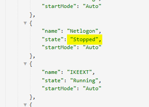
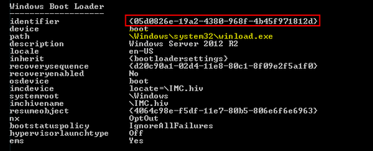
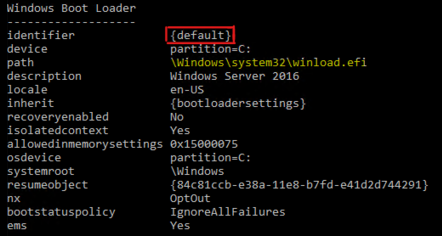

# Azure Virtual Machine - Network Store Interface service is not starting

## Symptoms

1. The virtual machine (VM) screenshot shows the operating system (OS) fully loaded and waiting for the credentials.

   

2. In the **WinGuestAnalyzer\Health Signal** tab, the service is currently in not in a **Running** state. As this service is the core service for the network component on the OS, all related network services like BFE or Windows Firewall will not start:

   

3. If you pull the Guest OS Logs, you'll see that the core networking service, Network Store Interface (NSI), is not starting or failing to start. This issue could be due to a hang, a crash of this service, or any required service to be run before it.

   ```cmd
      Log Name:      System
      Source:        Service Control Manager
      Date:          12/16/2015 11:19:36 AM
      Event ID:      7022
      Task Category: None
      Level:         Error
      Keywords:      Classic
      User:          N/A
      Computer:      myvm.contoso.net
      Description:
      The Network Store Interface service hung on starting.
   ```

   ```cmd
      Log Name:      System
      Source:        Service Control Manager
      Date:          2/25/2016 11:59:08 AM
      Event ID:      7001
      Task Category: None
      Level:         Error
      Keywords:      Classic
      User:          N/A
      Computer:      myvm.contoso.net
      Description:
      The DHCP Client service depends on the Network Store Interface service which failed to start because of the following error: 
      The service cannot be started, either because it is disabled or because it has no enabled devices associated with it.
   ```

   ```cmd
      Log Name:      System
      Source:        Service Control Manager
      Date:          12.08.2016 15:35:22
      Event ID:      7000
      Task Category: None
      Level:         Error
      Keywords:      Classic
      User:          N/A
      Computer:      myvm.contoso.net
      Description:
      The Network Store Interface Service service failed to start due to the following error: 
      The account specified for this service is different from the account specified for other services running in the same process.
   ```

4. It's possible that you don't see any attempt to start this service during the booting time, which can happen if the service was disabled.

## Cause

The NSI service is not running on the Virtual Machine. This issue happens in the following scenarios:

1. The NSI service was set to disabled.
2. The NSI is crashing. The RCA will depend on the dump from the process.
3. The NSI is hanging. The RCA will depend on the dump from the process.
4. Another required service is not running. The RCA will depend on why the other service was not starting.

## Solution

### Process Overview

1. Create and access a Repair VM.

1. Verify that the OS partition is active.
1. Find the missing reference on the BCD store.

1. Enable serial console and memory dump collection.
1. Rebuild the VM.

> [!NOTE]
> When encountering this error, the Guest OS is not operational. Troubleshoot this issue in offline mode to resolve this issue.

### Create and Access a Repair VM

1. Use steps 1-3 of the [VM Repair Commands](./repair-windows-vm-using-azure-virtual-machine-repair-commands.md) to prepare a Repair VM.
1. Using Remote Desktop Connection, connect to the Repair VM.

### Verify that the OS partition is active

> [!NOTE]
> This mitigation applies only for Generation 1 VMs. Generation 2 VMs (using UEFI) does not have active partition.

Verify the OS partition, which holds the BCD store for the disk is marked as active.

   1. Open an elevated command prompt and open up DISKPART tool.

      `diskpart`

   2. List the disks on the system and look for added disks and proceed to select the new disk. In this example, this is Disk 1.

      ```cmd
      list disk
      sel disk 1
      ```

      

   3. List all the partitions on that disk and then proceed to select the partition you want to check. Usually System Managed partitions are smaller and are around 350 Mb. In the image below, this will be Partition 1.

      ```cmd
      list partition
      sel partition 1
      ```

      

   4. Check the status of the partition. The same should be Active.

      `detail partition`

      

      1. If the partition isn't active:

         1. Now change the Active flag and then recheck the change was done properly.

            ```cmd
            active
            detail partition
            ```

            

   5. Now exist DISKPART tool.

      `exit`

### Mitigation 2

1. Open up an elevated CMD and run CHKDSK on that disks.

   `chkdsk <DRIVE LETTER>: /f`

2. Gather the current booting setup info and document it, and use this step to take note of the identifier on the active partition.

   1. For Generation 1 VM:

      `bcdedit /store <drive letter>:\boot\bcd /enum`

      1. If this errors out because there's no `\boot\bcd` file, then go to the following mitigation.

      2. Write down the identifier of the Windows Boot loader. This is the one which path is `\windows\system32\winload.exe`.

         

   2. For Generation 2 VM:

      `bcdedit /store <Volume Letter of EFI System Partition>:EFI\Microsoft\boot\bcd /enum`

      1. If this errors out because there's no \boot\bcd file, then go to the following mitigation.

      2. Write down the identifier of the Windows Boot loader. This is the one which path is `\windows\system32\winload.efi`.

         

3. Run the following commands:

   1. For **Generation 1** VM:

      ```cmd
      bcdedit /store <BCD FOLDER - DRIVE LETTER>:\boot\bcd /set {bootmgr} device partition=<BCD FOLDER - DRIVE LETTER>:
      bcdedit /store <BCD FOLDER - DRIVE LETTER>:\boot\bcd /set {bootmgr} integrityservices enable
      bcdedit /store <BCD FOLDER - DRIVE LETTER>:\boot\bcd /set {<IDENTIFIER>} device partition=<WINDOWS FOLDER - DRIVE LETTER>:
      bcdedit /store <BCD FOLDER - DRIVE LETTER>:\boot\bcd /set {<IDENTIFIER>} integrityservices enable
      bcdedit /store <BCD FOLDER - DRIVE LETTER>:\boot\bcd /set {<IDENTIFIER>} recoveryenabled Off
      bcdedit /store <BCD FOLDER - DRIVE LETTER>:\boot\bcd /set {<IDENTIFIER>} osdevice partition=<WINDOWS FOLDER - DRIVE LETTER>:
      bcdedit /store <BCD FOLDER - DRIVE LETTER>:\boot\bcd /set {<IDENTIFIER>} bootstatuspolicy IgnoreAllFailures
      ```

      >[!NOTE]
      In case the VHD has a single partition and both the BCD Folder and Windows Folder are in the same volume, and if the above setup didn't work, then try replacing the partition values with ***boot***.

      ```cmd
      bcdedit /store <BCD FOLDER - DRIVE LETTER>:\boot\bcd /set {bootmgr} device boot
      bcdedit /store <BCD FOLDER - DRIVE LETTER>:\boot\bcd /set {bootmgr} integrityservices enable
      bcdedit /store <BCD FOLDER - DRIVE LETTER>:\boot\bcd /set {<IDENTIFIER>} device boot
      bcdedit /store <BCD FOLDER - DRIVE LETTER>:\boot\bcd /set {<IDENTIFIER>} integrityservices enable
      bcdedit /store <BCD FOLDER - DRIVE LETTER>:\boot\bcd /set {<IDENTIFIER>} recoveryenabled Off
      bcdedit /store <BCD FOLDER - DRIVE LETTER>:\boot\bcd /set {<IDENTIFIER>} osdevice boot
      bcdedit /store <BCD FOLDER - DRIVE LETTER>:\boot\bcd /set {<IDENTIFIER>} bootstatuspolicy IgnoreAllFailures
      ```

   2. For **Generation 2** VM:

      ```cmd
      bcdedit /store <Volume Letter of EFI System Partition>:EFI\Microsoft\boot\bcd /set {bootmgr} device partition=<Volume Letter of EFI System Partition>:
      bcdedit /store <Volume Letter of EFI System Partition>:EFI\Microsoft\boot\bcd /set {bootmgr} integrityservices enable
      bcdedit /store <Volume Letter of EFI System Partition>:EFI\Microsoft\boot\bcd /set {<IDENTIFIER>} device partition=<WINDOWS FOLDER - DRIVE LETTER>:
      bcdedit /store <Volume Letter of EFI System Partition>:EFI\Microsoft\boot\bcd /set {<IDENTIFIER>} integrityservices enable
      bcdedit /store <Volume Letter of EFI System Partition>:EFI\Microsoft\boot\bcd /set {<IDENTIFIER>} recoveryenabled Off
      bcdedit /store <Volume Letter of EFI System Partition>:EFI\Microsoft\boot\bcd /set {<IDENTIFIER>} osdevice partition=<WINDOWS FOLDER - DRIVE LETTER>:
      bcdedit /store <Volume Letter of EFI System Partition>:EFI\Microsoft\boot\bcd /set {<IDENTIFIER>} bootstatuspolicy IgnoreAllFailures
      ```

      >[!NOTE]
      In some cases the variables Devices and OSDevices in {< IDENTIFIER >} were pointing to the correct partition but still the OS was unable to boot. For those cases, a rewrite could fix the machine start up.

   Detach the disk and wait until Azure updates the disk, then re-assemble the VM.

If those steps don't resolve the issue, then recreate the BCD store entirely.

1. Attach the disk again on the rescue VM.

2. Before doing any other change, do a backup of the current `\boot` folder.

   1. For **Generation 1** VM:

      ```cmd
      REM Create a copy of the BuiltIn BCD template that comes within each windows installation. In this case as the OS is Gen 1, use the BIOS flag
      bcdboot <WINDOWS FOLDER - DRIVE LETTER>:\windows /s <BCD FOLDER - DRIVE LETTER>: /v /f BIOS
        
      REM Re-add the following flags which are not going to be there by default:
      bcdedit /store <BCD FOLDER - DRIVE LETTER>:\boot\bcd /set {<IDENTIFIER FROM THE BOOT LOADER>} integrityservices enable
      bcdedit /store <BCD FOLDER - DRIVE LETTER>:\boot\bcd /set {<IDENTIFIER FROM THE BOOT LOADER>} recoveryenabled Off
      bcdedit /store <BCD FOLDER - DRIVE LETTER>:\boot\bcd /set {<IDENTIFIER FROM THE BOOT LOADER>} bootstatuspolicy IgnoreAllFailures 
        
      REM Renable EMS to enable the serial console feature
      bcdedit /store <BCD FOLDER - DRIVE LETTER>:\boot\bcd /set {bootmgr} displaybootmenu yes
      bcdedit /store <BCD FOLDER - DRIVE LETTER>:\boot\bcd /set {bootmgr} timeout 5
      bcdedit /store <BCD FOLDER - DRIVE LETTER>:\boot\bcd /set {bootmgr} bootems yes
      bcdedit /store <BCD FOLDER - DRIVE LETTER>:\boot\bcd /ems {current} on 
      bcdedit /store <BCD FOLDER - DRIVE LETTER>:\boot\bcd /emssettings EMSPORT:1 EMSBAUDRATE:115200
      ```

   2. For **Generation 2** VM:

      ```cmd
      REM Create a copy of the BuiltIn BCD template that comes within each windows installation. In this case as the OS is Gen 1, use the UEFI flag
      bcdboot <WINDOWS FOLDER - DRIVE LETTER>:\windows /s <Volume Letter of EFI System Partition>: /v /f UEFI
       
      REM Re-add the following flags which are not going to be there by default:
      bcdedit /store <BCD FOLDER - DRIVE LETTER>:\boot\bcd /set {<IDENTIFIER>} integrityservices enable
      bcdedit /store <BCD FOLDER - DRIVE LETTER>:\boot\bcd /set {<IDENTIFIER>} recoveryenabled Off
      bcdedit /store <BCD FOLDER - DRIVE LETTER>:\boot\bcd /set {<IDENTIFIER>} bootstatuspolicy IgnoreAllFailures
       
      REM Renable EMS to enable the serial console feature
      bcdedit /store <BCD FOLDER - DRIVE LETTER>:\boot\bcd /set {bootmgr} displaybootmenu yes
      bcdedit /store <BCD FOLDER - DRIVE LETTER>:\boot\bcd /set {bootmgr} timeout 5
      bcdedit /store <BCD FOLDER - DRIVE LETTER>:\boot\bcd /set {bootmgr} bootems yes
      bcdedit /store <BCD FOLDER - DRIVE LETTER>:\boot\bcd /ems {current} on 
      bcdedit /store <BCD FOLDER - DRIVE LETTER>:\boot\bcd /emssettings EMSPORT:1 EMSBAUDRATE:115200
      ```

### Enable the Serial Console and memory dump collection

**Recommended**: Before you rebuild the VM, enable the Serial Console and memory dump collection by running the following script:

1. Open an elevated command prompt session as an Administrator.
1. Run the following commands:

   **Enable the Serial Console**:

   ```cmd
   bcdedit /store <VOLUME LETTER WHERE THE BCD FOLDER IS>:\boot\bcd /ems {<BOOT LOADER IDENTIFIER>} ON 
   bcdedit /store <VOLUME LETTER WHERE THE BCD FOLDER IS>:\boot\bcd /emssettings EMSPORT:1 EMSBAUDRATE:115200
   ```

1. Verify that the free space on the OS disk is larger than the memory size (RAM) on the VM.

   If there's not enough space on the OS disk, change the location where the memory dump file will be created, and refer that location to any data disk attached to the VM that has enough free space. To change the location, replace **%SystemRoot%** with the drive letter of the data disk, such as **F:**, in the following commands.

   Suggested configuration to enable OS Dump:

    **Load the broken OS Disk:**

   ```cmd
   REG LOAD HKLM\BROKENSYSTEM <VOLUME LETTER OF BROKEN OS DISK>:\windows\system32\config\SYSTEM 
   ```

   **Enable on ControlSet001**:

   ```cmd
   REG ADD "HKLM\BROKENSYSTEM\ControlSet001\Control\CrashControl" /v CrashDumpEnabled /t REG_DWORD /d 1 /f 
   REG ADD "HKLM\BROKENSYSTEM\ControlSet001\Control\CrashControl" /v DumpFile /t REG_EXPAND_SZ /d "%SystemRoot%\MEMORY.DMP" /f 
   REG ADD "HKLM\BROKENSYSTEM\ControlSet001\Control\CrashControl" /v NMICrashDump /t REG_DWORD /d 1 /f
   ```

   **Enable on ControlSet002**:

   ```cmd
   REG ADD "HKLM\BROKENSYSTEM\ControlSet002\Control\CrashControl" /v CrashDumpEnabled /t REG_DWORD /d 1 /f 
   REG ADD "HKLM\BROKENSYSTEM\ControlSet002\Control\CrashControl" /v DumpFile /t REG_EXPAND_SZ /d "%SystemRoot%\MEMORY.DMP" /f 
   REG ADD "HKLM\BROKENSYSTEM\ControlSet002\Control\CrashControl" /v NMICrashDump /t REG_DWORD /d 1 /f
   ```

   **Unload Broken OS Disk**:

   ```cmd
   REG UNLOAD HKLM\BROKENSYSTEM
   ```

### Rebuild the VM

Use [step 5 of the VM Repair Commands](./repair-windows-vm-using-azure-virtual-machine-repair-commands.md#repair-process-example) to rebuild the VM.

## Next steps

If you still cannot determine the cause of the issue and need more help, you can open a support ticket with Microsoft Customer Support.

If you need more help at any point in this article, you can contact the Azure experts on the [MSDN Azure and Stack Overflow forums](https://azure.microsoft.com/support/forums/). Alternatively, you can file an Azure support incident. Go to the [Azure support site](https://azure.microsoft.com/support/options/), and select **Get support**. For information about using Azure support, read the [Microsoft Azure support FAQ](https://azure.microsoft.com/support/faq/).
