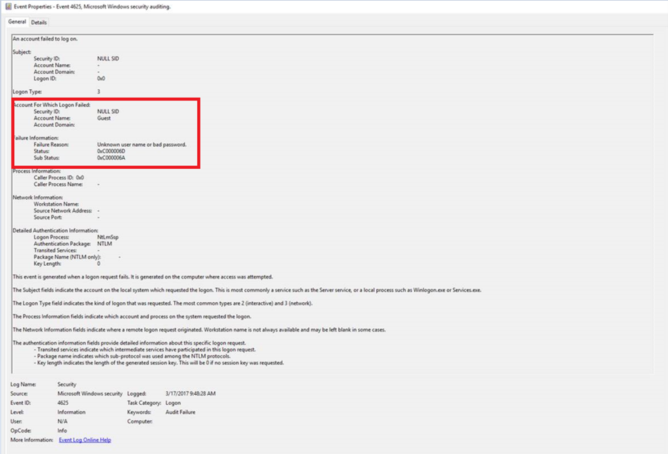
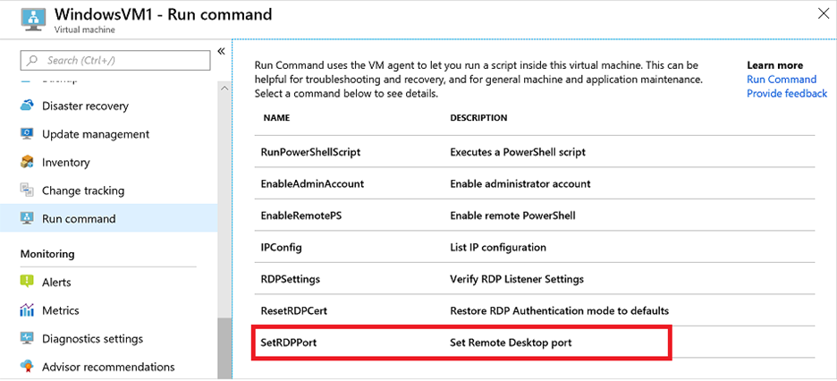

# Cannot RDP to an Azure VM due to a brute force attack

Open ports on Internet-facing virtual machines are targets for brute force attacks. This article describes general errors you may experience when your Azure virtual machine (VM) is under attack and its resolution.

## Symptoms

1. When you make a Remote Desktop Protocol (RDP) connection to a Window VM in Azure, you may receive the following general error messages:

    - An internal error has occurred.
    - Remote Desktop Services session has ended. Your network administrator might have ended the connection. Try connecting again, or contact technical support for assistance.

2. You are unable to RDP using the Public IP address, and you may be able to RDP using the Private IP address. This will depend on whether you have a performance spike due to the attack.

3. There are too many Audit Failure Messages in Security Event Logs:

   - Events 4625 from logon is logged almost every second, with the failure reason **Bad Username Or Password**.

   

   

## Cause

The machine is under brute force attack, and the VM needs to be secured.

## Solution

> [!NOTE]
> RDP port 3389 is exposed to the Internet. Use this port only for testing. For production environments, use a virtual private network (VPN) or private connection.

To mitigate the issue, reinforce security in your environment:

1. Allow specific internet protocols (IPs) or a range of IPs in your Network Security Group (NSG) within the inbound rule for RDP:

   Check whether the network security group for **RDP port 3389** is unsecured (open). If it's unsecured and it shows * as the source IP address for inbound, [restrict the RDP port to a specific user's IP address](https://docs.microsoft.com/azure/virtual-network/network-security-groups-overview#security-rules), and then test RDP access again.

2. If the IPs are dynamic for the end-users, introduce an intermediate server into your setup, which can be used to login to the destination machine.

3. Use **Run Command** to change the default RDP port from 3389 to any port number which is less common.

   

4. Use [Just-In-Time access](https://docs.microsoft.com/azure/security-center/security-center-just-in-time?tabs=jit-config-asc%2Cjit-request-asc#enable-jit-vm-access-)

> [!NOTE]
> Use [Azure Security Centre](https://azure.microsoft.com/services/security-center/) to assess the security state of your cloud resources. Visualize your security state, and improve your security posture by using [Azure Secure Score](https://docs.microsoft.com/azure/security-center/secure-score-security-controls) recommendations.
