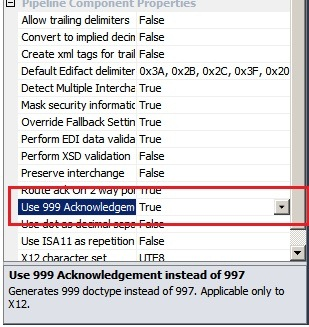
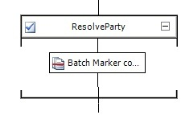

# Generate 999 Acknowledgments for HIPAA 5010 in BizTalk Server 2010

This article describes how to generate 999 functional Acknowledgments using a custom pipeline with this new 999 schema.

_Original product version:_ &nbsp; BizTalk Server Branch 2010, BizTalk Server Developer 2010, BizTalk Server Enterprise 2010, BizTalk Server Standard 2010  
_Original KB number:_ &nbsp; 2669948

## Summary

BizTalk Server 2010 cumulative update 3 includes a schema that allows 999 Acknowledgments for HIPAA 5010.

## Steps to extract the new 999 schema

1. Download Cumulative Update 3 for BizTalk Server 2010:

2. To extract the schema, launch the BiztalkServer2010-RTM-KB2617149-ENU.exe setup. A temporary folder named with a unique GUID is created on the `c:\drive`. In this folder, the following two files contain the *X12_00501_277_A* and *X12_00501_999* schemas:

   - MicrosoftEdiXSDTemplatesKb2510733.exe: Run as Administrator to extract the schema
   - MicrosoftEdiXSDTemplatesKb2566805.zip: Unzip to extract the schema

   Save this 999 schema. As a best practice, copy the schema to the `C:\Program Files (x86)\Microsoft BizTalk Server 2010\XSD_Schema\EDI` folder.

    > [!NOTE]
    > Only the X12_00501_999 schema is needed.

3. If CU3 hasn't been installed, continue with the installation. It must be installed to include the 999 acknowledgment functionality. Once CU3 is installed, you must create a custom pipeline to utilize the new 999 schema and functionality.

## Steps to create the custom pipeline

1. In Visual Studio, create a new Empty BizTalk Project. Then, do the following:

    1. Add an existing item and add the X12_00501_999.xsd schema you extracted.
    1. Add a new receive pipeline.
    1. From the Toolbox, drag and drop the EDI disassembler component to the Disassembler stage of the pipeline:

        

    1. In the EDI disassembler Pipeline Component Properties, set the Use 999 acknowledgment instead of 997 property to True:

        

    1. From the Toolbox, drag and drop the Batch Marker component to the ResolveParty stage. Leave the default property settings:

        

        > [!NOTE]
        > This Batch Marker component is also used with the EDI Batching Orchestration.

    1. Build and deploy this project to the BizTalk EDI Application. Any new or existing application can be used. If the goal is to keep all core EDI items together, use the existing BizTalk EDI Application.

1. Create a new HIPAA Application:

    1. Open the BizTalk Administration console. You can create a new Application or use an existing application.
    1. Add a reference to the new pipeline application. If the BizTalk EDI Application was used, add a reference to it.
    1. Create a new Receive Port and Receive Location for incoming HIPAA 5010 messages. In the Receive Pipeline, select the pipeline you created. Confirm that the Override997With999 property is set to True. If not, set it True.

    [Configuring a Port to Receive EDI Messages and Acknowledgments](/biztalk/core/configuring-a-port-to-receive-edi-messages-and-acknowledgments) provides information on configuring EDI receive.

    Create a send port for the EDI message and specify the following:

    - For the Send pipeline, select EDISend.
    - Add the following filter:

      `BTS.MessageType==http://schemas.microsoft.com/BizTalk/EDI/X12/2006#X12_00501_999`

    [Configuring a Static Send Port to Send EDI Interchanges and Acknowledgments](/biztalk/core/configuring-a-static-send-port-to-send-edi-interchanges-and-acknowledgments) provides information on configuring an EDI send port.

1. Create a Party and an Agreement to generate the 999 acknowledgments:

    1. Create a party and the agreement. The specific steps are available at [Configuring EDI Properties.](/biztalk/core/configuring-edi-properties)

    1. Configure the sending and receiving of the Acknowledgments, including enabling the 997 acknowledgment. The specific steps are available at [Configuring the Sending and Receiving of EDI Acknowledgments](/biztalk/core/configuring-the-sending-and-receiving-of-edi-acknowledgments). The goal is to create the acknowledgment as if you were receiving a 997.

   When the 997 acknowledgment is enabled, BizTalk EDI assumes that 997 Acknowledgment must be generated for the incoming message from the party. With the `Override997With999` property set to **True**, a 999 is returned *instead* of a 997. If you don't want a 997 or 999, uncheck the 997 Expected property in the agreement. A 997 and 999 acknowledgment cannot be generated simultaneously. If this is the goal, a custom pipeline component is needed.

   > [!NOTE]
   > The Acknowledgements property in the X12 Agreement Settings tab of the party is not updated with a 999 checkbox.

## Key Points

- When the EDIReceive pipeline is used in a receive location, the `Override997With999` option is not available. To generate 999 Acknowledgments, you must create a custom receive pipeline and set the Use 999 Acknowledgment Instead of 997 option to **True**; as described above.

- Use the `Override997With999` option in the pipeline configuration setting in BizTalk Administration to enable or disable generating 999 Acknowledgments.

- Do not use the Extended Validation property in Validation in the agreement. Otherwise, 999 acknowledgment messages will suspend.

- If the Transaction Type property in Envelopes in the agreement is set to **277_A**, the GS1 value is not updated to HN.
