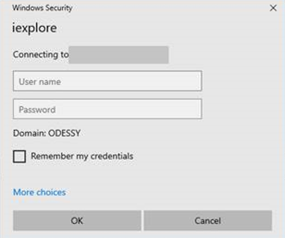
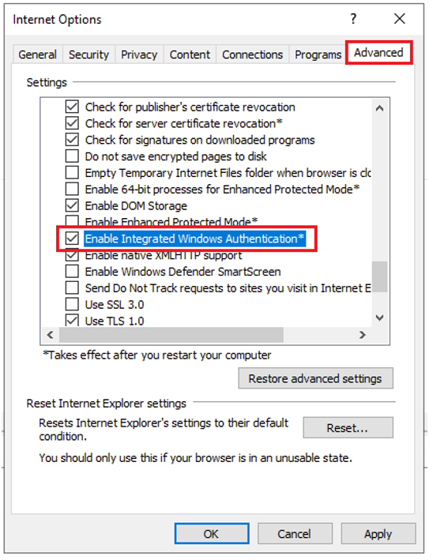
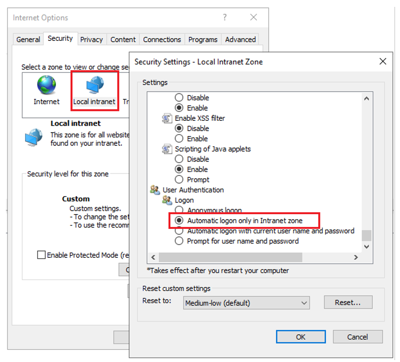
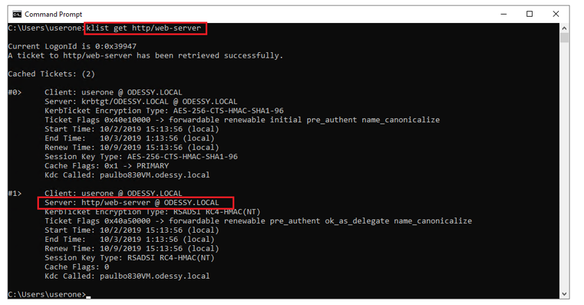

# Troubleshoot Kerberos failures in Internet Explorer

This article can help you to isolate and fix the causes of various errors that you may experience when you access websites that are configured to use Kerberos authentication in Internet Explorer. The number of potential issues that may occur is almost as large as the number of tools that are available to solve them.

## Common symptom when Kerberos fails

You try to access a website for which Windows Integrated Authenticated has been configured and for which you expect to be using the Kerberos authentication protocol. When you access the website, your browser immediately prompts you for credentials, as follows:



Although you enter a valid user name and password, you're prompted again (three prompts total). Then, you're shown a screen that indicates that you aren't allowed to access the desired resource. The screen displays a HTTP 401 status code that resembles the following error:

:::image type="content" source="./media/troubleshoot-kerberos-failures-ie/http-error-401.png" alt-text="Screenshot of http error 401.":::

On the Microsoft Internet Information Services (IIS) server, the website logs contains requests that end in a 401.2 status code, such as the following log:

```console
#Fields: date time s-ip cs-method cs-uri-stem cs-uri-query s-port cs-username c-ip cs(User-Agent) cs(Referer) sc-status sc-substatus sc-win32-status time-taken  
DateTime IP GET /whoami.aspx - 80 – IP Mozilla/4.0+(compatible;+MSIE+7.0;+Windows+NT+10.0;+WOW64;+Trident/7.0;+.NET4.0C;+.NET4.0E;+.NET+CLR+2.0.50727;+.NET+CLR+3.0.30729;+.NET+CLR+3.5.30729) - 401 2 5 1270  
DateTime IP GET /whoami.aspx - 80 - IP Mozilla/4.0+(compatible;+MSIE+7.0;+Windows+NT+10.0;+WOW64;+Trident/7.0;+.NET4.0C;+.NET4.0E;+.NET+CLR+2.0.50727;+.NET+CLR+3.0.30729;+.NET+CLR+3.5.30729) - 401 2 5 8
```

Alternatively, the screen displays a 401.1 status codes, such as the following:

```console
#Fields: date time s-ip cs-method cs-uri-stem cs-uri-query s-port cs-username c-ip cs(User-Agent) cs(Referer) sc-status sc-substatus sc-win32-status time-taken  
DateTime IP GET /whoami.aspx - 80 - IP Mozilla/4.0+(compatible;+MSIE+7.0;+Windows+NT+10.0;+WOW64;+Trident/7.0;+.NET4.0C;+.NET4.0E;+.NET+CLR+2.0.50727;+.NET+CLR+3.0.30729;+.NET+CLR+3.5.30729) - 401 2 5 105  
DateTime IP GET /whoami.aspx - 80 - IP Mozilla/4.0+(compatible;+MSIE+7.0;+Windows+NT+10.0;+WOW64;+Trident/7.0;+.NET4.0C;+.NET4.0E;+.NET+CLR+2.0.50727;+.NET+CLR+3.0.30729;+.NET+CLR+3.5.30729) - 401 1 2148074245 18
```

## Determine whether Kerberos is used

When you troubleshoot Kerberos authentication failure, we recommend that you simplify the configuration to the minimum (one client, one server, one IIS site that's running on the default port). Additionally, you can follow some basic troubleshooting steps. For example, use a test page to verify the authentication method that's used. If you use ASP.NET, you can create this [ASP.net authentication test page](/archive/blogs/friis/asp-net-authentication-test-page).

If you're using classic ASP, you can use the following Testkerb.asp page:  

```aspx
<%
    authType=UCase(Request.ServerVariables("AUTH_TYPE"))
    authHeader=Request.ServerVariables("HTTP_AUTHORIZATION")
    response.write " Authentication Method : " & authType & "<BR>"
    LenAuthHeader = len(authHeader)
    response.write " Protocol : "
    if Len(authType ) =0 then response.write " Anonymous" else if authType<>"NEGOTIATE" then response.write authType else if LenAuthHeader>1000 then response.write "Kerberos" else response.write  "NTLM"
%>
```

You can also use tools such as Fiddler, HttpWatch, Network Monitor, or the developer tools in your browser to determine whether Kerberos is used. For more information about how such traces can be generated, see [client-side tracing](https://techcommunity.microsoft.com/t5/iis-support-blog/how-to-take-an-http-trace-from-the-client/ba-p/799618).

When Kerberos is used, the request that's sent by the client is large (more than 2,000 bytes). This is because the `HTTP_AUTHORIZATION` header includes the Kerberos ticket. The following request is for a page that uses Kerberos-based Windows Authentication to authenticate incoming users. The size of the GET request is more than 4,000 bytes.

:::image type="content" source="./media/troubleshoot-kerberos-failures-ie/get-request-more-than-4000-bytes.png" alt-text="Screenshot of requests more than 4,000 bytes.":::

If the NTLM handshake is used, the request will be much smaller. The following client-side capture shows an NTLM authentication request. The GET request is much smaller (less than 1,400 bytes).

:::image type="content" source="./media/troubleshoot-kerberos-failures-ie/get-request-under-1400-bytes.png" alt-text="Screenshot of requests less than 1,400 bytes.":::

After you determine that Kerberos authentication is failing, check each of the following items in the given order.

## Things to check if Kerberos authentication fails

The following sections describes the things that you can use to check if Kerberos authentication fails.

### Are the client and server in the same domain

Using Kerberos requires a domain because a Kerberos ticket is delivered by the domain controller (DC). Advanced scenarios are also possible in which the client and server aren't in the same domain but in two domains of the same forest, or in two different forests. These possible scenarios are discussed in the [Why does Kerberos delegation fail between my two forests although it used to work](#why-does-kerberos-delegation-fail-between-my-two-forests-although-it-used-to-work) section of this article.

### Is IIS configured to use integrated authentication

:::image type="content" source="./media/troubleshoot-kerberos-failures-ie/windows-authentication.png" alt-text="Screenshot of windows authentication.":::

### Is integrated authentication enabled in Internet Explorer



### Does the URL that's used resolve to a security zone for which credentials can be sent

You should always run this check for sites that are matched to the Local Intranet zone of the browser or for sites in the Trusted Sites zone. You can check in which zone your browser decides to include the site. To do this, open to the **File** menu of Internet Explorer, and then select **Properties**. The **Properties** window will display the zone in which the browser has decided to include the site that you're browsing to.


You can check whether the zone in which the site is included allows Automatic logon by opening the **Internet options** menu of Internet Explorer, and selecting the **Security** tab. After you select the desired zone, select the **Custom level** button to display the settings and make sure that **Automatic logon** is selected. (Typically, this feature is turned on by default for the Intranet and Trusted Sites zones).



> [!NOTE]
> Even through this configuration is not common (because it requires the client to have access to a DC), Kerberos can be used for a URL in the Internet Zone. In this case, unless default settings are changed, the browser will always prompt the user for credentials. Kerberos delegation won't work in the Internet Zone. This is because Internet Explorer allows Kerberos delegation only for a URL in the Intranet and Trusted sites zones.

### Is the IIS server configured to send the WWW-Authenticate: Negotiate header

:::image type="content" source="./media/troubleshoot-kerberos-failures-ie/headers.png" alt-text="Screenshot of headers.":::

If IIS doesn't send this header, you will have to use the IIS Manager console to set the Negotiate header though the **NTAuthenticationProviders** configuration property (see [Windows Authentication Providers \<providers>](/iis/configuration/system.webserver/security/authentication/windowsauthentication/providers/)). You can access the console through the **Providers** setting of the Windows Authentication details in the IIS manager.


> [!NOTE]
> By default, the **NTAuthenticationProviders** property is not set. This causes IIS to send both Negotiate and Windows NT LAN Manager (NTLM) headers.

### Are the client and server installed on the same computer

By default, Kerberos isn't enabled in this configuration. To change this behavior, you have to set the `DisableLoopBackCheck` registry key. For more information, see [KB 926642](https://support.microsoft.com/help/926642/error-message-when-you-try-to-access-a-server-locally-by-using-its-fqd).

### Can the client get a Kerberos ticket

You can use the Kerberos List (KLIST) tool to verify that the client computer can obtain a Kerberos ticket for a given service principal name (SPN). In this example, the SPN is http/web-server.

> [!NOTE]
> KLIST is a native Windows tool since Windows Server 2008 for server-side operating systems and Windows 7 Service Pack 1 for client-side operating systems.



If the Kerberos ticket request fails, Kerberos authentication isn't used. NTLM fallback may occur if the Kerberos ticket request fails. This is because the SPN requested is unknown to the DC. If the DC is unreachable, no NTLM fallback occurs.

In order to declare an SPN, see [How to use SPNs when you configure Web applications that are hosted on Internet Information Services](https://support.microsoft.com/help/929650/how-to-use-spns-when-you-configure-web-applications-that-are-hosted-on).

### Does the web server use a port other than default (80)

By default, Internet Explorer doesn't include the port number information in the SPN that's used to request a Kerberos ticket. This can be a problem if you use IIS to host multiple sites under different ports and identities. In this configuration, Kerberos authentication may work only for specific sites even if all SPNs have been correctly declared in Active Directory. To fix this issue, you must set the `FEATURE_INCLUDE_PORT_IN_SPN_KB908209` registry value. (See the [Internet Explorer feature keys](#internet-explorer-feature-keys) section for information about how to declare the key.) This setting forces Internet Explorer to include the port number in the SPN that's used to request the Kerberos ticket.

### Does Internet Explorer use the expected SPN

If a website is accessed by using an alias name (CNAME), Internet Explorer first uses DNS resolution to resolve the alias name to a computer name (ANAME). The computer name is then used to build the SPN and request a Kerberos ticket. Therefore, even if the URL that is entered in the Internet Explorer address bar is `http://MYWEBSITE`, Internet Explorer requests an SPN for HTTP/MYSERVER if MYWEBSITE is an alias (CNAME) of MYSERVER (ANAME). You can change this behavior by using the `FEATURE_USE_CNAME_FOR_SPN_KB911149` registry key. (See the [Internet Explorer feature keys](#internet-explorer-feature-keys) for information about how to declare the key.)

A Network Monitor trace is a good method to check the SPN that's associated with the Kerberos ticket, as in the following example:

```console
- Http: Request, GET /whoami.aspx , Using GSS-API Authorization
    Command: GET
  - URI: /whoami.aspx
     Location: /whoami.aspx
    ProtocolVersion: HTTP/1.1
    Accept:  image/gif, image/jpeg, image/pjpeg, application/x-ms-application, application/xaml+xml, application/x-ms-xbap, */*
    Accept-Language:  en-US,en;q=0.5
    UserAgent:  Mozilla/4.0 (compatible; MSIE 7.0; Windows NT 10.0; WOW64; Trident/7.0; .NET4.0C; .NET4.0E; .NET CLR 2.0.50727; .NET CLR 3.0.30729; .NET CLR 3.5.30729)
    Accept-Encoding:  gzip, deflate
    Host:  web-server
    Connection:  Keep-Alive
  - Authorization: Negotiate
   - Authorization:  Negotiate YIILcAYGKwYBBQUCoIILZDCCC2CgMDAuBgkqhkiC9xIBAgIGCSqGSIb3EgECAgYKKwYBBAGCNwICHgYKKwYBBAGCNwICCqKCCyoEggsmYIILIgYJKoZIhvcSAQICAQBuggsRMIILDaADAgEFoQMCAQ6iBwMFACAAAACjggRtYYIEaTCCBGWgAwIBBaEOGwxPREVTU1kuTE9DQUyiKjAooAMCAQKhITAfGwRIVFRQG
      WhiteSpace:  
    - NegotiateAuthorization:
       Scheme: Negotiate
     - GssAPI: 0x1
      - InitialContextToken:
       + ApplicationHeader:
       + ThisMech: SpnegoToken (1.3.6.1.5.5.2)
       - InnerContextToken: 0x1
        - SpnegoToken: 0x1
         + ChoiceTag:
         - NegTokenInit:
          + SequenceHeader:
          + Tag0:
          + MechTypes: Prefer MsKerberosToken (1.2.840.48018.1.2.2)
          + Tag2:
          + OctetStringHeader:
          - MechToken: 0x1
           - MsKerberosToken: 0x1
            - KerberosInitToken:
             + ApplicationHeader:
             + ThisMech: KerberosToken (1.2.840.113554.1.2.2)
             - InnerContextToken: 0x1
              - KerberosToken: 0x1
                 TokId: Krb5ApReq (0x100)
               - ApReq: KRB_AP_REQ (14)
                + ApplicationTag:
                + SequenceHeader:
                + Tag0:
                + PvNo: 5
                + Tag1:
                + MsgType: KRB_AP_REQ (14)
                + Tag2: 0x1
                + ApOptions:
                + Tag3:
                - Ticket: Realm: ODESSY.LOCAL, Sname: HTTP/web-server.odessy.local
                 + ApplicationTag:
                 + SequenceHeader:
                 + Tag0:
                 + TktVno: 5
                 + Tag1:
                 + Realm: ODESSY.LOCAL
                 + Tag2: 0x1
                 + Sname: HTTP/web-server.odessy.local
                 + Tag3: 0x1
                 + EncPart:
                + Tag4:
```

### Does the application pool identity match the account associated with SPN

When a Kerberos ticket is sent from Internet Explorer to an IIS server, the ticket is encrypted by using a private key. The private key is a hash of the password that's used for the user account that's associated with the SPN. Therefore, only an application that's running under this account will be able to decode the ticket.

The following procedure is a summary of the Kerberos authentication algorithm:

1. Internet Explorer determines an SPN by using the URL that's entered into the address bar.

2. The SPN is passed through a Security Support Provider Interface (SSPI) API (InitializeSecurityContext) to the system component that's in charge of Windows security (the Local Security Authority Subsystem Service (LSASS) process). At this stage, you can see that the Internet Explorer code doesn't implement any code to construct the Kerberos ticket. Internet Explorer calls only SSPI APIs.

3. LSASS uses the SPN that's passed in to request a Kerberos ticket to a DC. If the DC can serve the request (known SPN), it creates a Kerberos ticket, and then encrypts the ticket by using a key that's constructed from the hash of the user account password for the account that's associated with the SPN. LSASS then sends the ticket to the client. As far as Internet Explorer is concerned, the ticket is an opaque blob.

4. Internet Explorer encapsulates the Kerberos ticket that's provided by LSASS in the `Authorization: Negotiate` header, and then it sends the ticket to the IIS server.

5. IIS handles the request and routes it to the correct application pool (by using the host header that's specified).

6. The application pool tries to decrypt the ticket by using SSPI/LSASS APIs and by following these conditions:

   - If the ticket can be decrypted, Kerberos authentication succeeds, and all services that are associated with the ticket (impersonation, delegation if ticket allows it, and so on) are available.

   - If the ticket can't be decrypted, a Kerberos error (KRB_AP_ERR_MODIFIED) is returned. This error is a generic error that indicates that the ticket was altered in some manner during its transport. Therefore, the ticket cannot be decrypted. This error is also logged in the Windows event logs.

If you don't explicitly declare an SPN, Kerberos authentication works only if the application pool identity is one of the following:

- Network Service
- ApplicationPoolIdentity
- Another system account such as LOCALSYSTEM or LOCALSERVICE

However, these identities are not recommended because they are a security risk. In this case, the Kerberos ticket is built by using a default SPN that's created in Active Directory when a computer (in this case, the server that IIS is running on) is added to the domain. This default SPN is associated with the computer account. Under IIS, the computer account maps to Network Service or ApplicationPoolIdentity.

If your application pool has to use an identity other than the listed identities, you'll have to declare an SPN (using [SETSPN](/previous-versions/windows/it-pro/windows-server-2003/cc773257(v=ws.10)?redirectedfrom=MSDN)), and then associate it with the account that's used for your application pool identity. A common mistake is to create similar SPNs that have different accounts. For example:

- SETSPN http/mywebsite UserAppPool1  
- SETSPN http/mywebsite UserAppPool2

This configuration won't work because there is no deterministic way to know whether the Kerberos ticket for the http/mywebsite SPN will be encrypted by using the UserAppPool1 or UserAppPool2 password. This configuration typically generates KRB_AP_ERR_MODIFIED errors. To determine whether you are in this (bad) duplicate SPNs scenario, you can use the tools that are documented in [Why you can still have duplicate SPNs in AD 2012 R2 and AD 2016](/archive/blogs/389thoughts/why-you-can-still-have-duplicate-spns-in-ad-2012-r2-and-ad-2016). From Windows Server 2008 onwards, you can also use an updated version of SETSPN for Windows that allows the detection of duplicate SPNs by using the `setspn –X` command when you declare a new SPN for your target account. For more information, see [Setspn](/previous-versions/windows/it-pro/windows-server-2012-r2-and-2012/cc731241(v%3Dws.11)).

We also recommended that you review the following articles:

- [Kerberos Authentication problems – Service Principal Name (SPN) issues - Part 1](/archive/blogs/askds/kerberos-authentication-problems-service-principal-name-spn-issues-part-1)

- [Kerberos Authentication problems – Service Principal Name (SPN) issues - Part 2](/archive/blogs/askds/kerberos-authentication-problems-service-principal-name-spn-issues-part-2)

- [Kerberos Authentication problems – Service Principal Name (SPN) issues - Part 3](/archive/blogs/askds/kerberos-authentication-problems-service-principal-name-spn-issues-part-3)

### Does Kerberos authentication fail in IIS 7 and later versions even though it works in IIS 6

Kernel mode authentication is a feature that was introduced in IIS 7. It provides the following advantages:

- Performance is increased because kernel-mode-to-user-mode transitions are no longer made.
- Kerberos ticket decoding is made by using the machine account (not by using application pool identity). This lets you have multiple applications pools running under different identities without having to declare SPNs.

> [!WARNING]
> If an SPN has been declared for a specific user account (also used as application pool identity), kernel mode authentication can't decrypt the Kerberos ticket because it uses the machine account. This problem is typical in web farm scenarios. This is because this scenario usually declares an SPN for the (virtual) NLB hostname. To prevent this from occurring, you can do either of the following:
>
> - Disable Kernel mode authentication. (Not recommended from a performance standpoint.)
> - Set **useAppPoolCredentials** to **true**. (Doing this retains the performance benefit of kernel mode authentication while allowing the Kerberos ticket to be decoded under the application pool identity). For more information, see [New in IIS 7 - Kernel Mode Authentication](http://www.adopenstatic.com/cs/blogs/ken/archive/2008/02/12/16189.aspx).

### Why does delegation fail although Kerberos authentication works

In this scenario, check the following items:

- The Internet Explorer Zone that's used for the URL. Kerberos delegation is allowed only for the Intranet and Trusted Sites zones. (In other words, Internet Explorer sets the `ISC_REQ_DELEGATE` flag when it calls [InitializeSecurityContext](/windows/win32/api/sspi/nf-sspi-initializesecuritycontexta) only if the zone that is determined is either Intranet or Trusted Sites.)

- The user account for the IIS application pool hosting your site must have the **Trusted for delegation** flag set within Active Directory.

If delegation still fails, consider using the Kerberos Configuration Manager for IIS. This tool lets you diagnose and fix IIS configurations for Kerberos authentication and for the associated SPNs on the target accounts. For more information, see the [README.md](https://github.com/SurajDixit/KerberosConfigMgrIIS/blob/master/README.md). You can download the tool from [here](https://github.com/SurajDixit/KerberosConfigMgrIIS/releases).

### Why do I get bad performance when I use Kerberos authentication

In older versions of Windows Server, such as Windows Server 2008 SP2 and Windows Server 2008 R2, Kerberos is a request-based authentication protocol. This means that the client must send the Kerberos ticket (that can be quite a large blob) with each request that's made to the server. This is contrary to authentication methods that rely on NTLM. By default, NTLM is session-based. This means that the browser will authenticate only one request when it opens the TCP connection to the server. Each subsequent request on the same TCP connection will no longer require authentication for the request to be accepted. In newer versions of IIS, from Windows 2012 R2 onwards, Kerberos is also session-based. This means that only the first request on a new TCP connection has to be authenticated by the server. Subsequent requests do not have to include a Kerberos ticket.

You can change this behavior by using the **authPersistNonNTLM** property if you are running under IIS 7 and later versions. If the property is set to **true**, Kerberos will become session based. If the property is set to **false**, it will be session-based. Therefore, it will have worse performance because we have to include a larger amount of data to send to the server each time. For more information, see [Request based versus Session based Kerberos Authentication (or the AuthPersistNonNTLM parameter)](https://techcommunity.microsoft.com/t5/iis-support-blog/request-based-versus-session-based-kerberos-authentication-or/ba-p/916043).

> [!NOTE]
> It may not be a good idea to blindly use Kerberos authentication on all objects. Using Kerberos authentication to fetch hundreds of images by using conditional GET requests that are likely generate **304 not modified** responses is like trying to kill a fly by using a hammer. Such a method will also not provide obvious security gains.

### Why does Kerberos delegation fail between my two forests although it used to work

Assume that you have a scenario in which the users of your application are located in a domain inside forest A, your application is located in a domain inside forest B, and you have a trust relationship between the forests. You may find the Kerberos delegation stops working even though it used to work previously and you have not made any changes to either forests or domains. Notice that Kerberos authentication still works in this scenario. It is only delegation that fails. This problem might occur because of security updates to Windows Server that were released by Microsoft in March 2019 and July 2019. These updates disabled unconstrained Kerberos delegation (the ability to delegate a Kerberos token from an application to a back-end service) across forest boundaries for all trusts (new and existing). For more information, see [Updates to TGT delegation across incoming trusts in Windows Server](https://support.microsoft.com/help/4490425/updates-to-tgt-delegation-across-incoming-trusts-in-windows-server).

## Internet Explorer feature keys

These are registry keys that turn some features of the browser on or off. The keys are located in the following registry locations:

- `HKEY_USERS\<UserSID>\Software\Microsoft\Internet Explorer\Main\FeatureControl` – if defined at the user level
- `HKEY_LOCAL_MACHINE\SOFTWARE\Microsoft\Internet Explorer\Main\FeatureControl\` - if defined at the machine level

Feature keys should be created in one of these locations, depending on whether you want to turn the feature on or off for all users on the computer or for only a specific account. These keys should be created under the respective path. Inside the key, a DWORD value that's named `iexplorer.exe` should be declared. The default value of each key should be set to either **true** or **false**, depending on the desired setting of the feature. By default, the value of both feature keys, `FEATURE_INCLUDE_PORT_IN_SPN_KB908209` and `FEATURE_USE_CNAME_FOR_SPN_KB911149`, is **false**. For completeness, here is an example export of the registry by turning the feature key to include port numbers in the Kerberos ticket to true:

```console
[HKEY_LOCAL_MACHINE\SOFTWARE\Microsoft\Internet Explorer\Main\FeatureControl\FEATURE_INCLUDE_PORT_IN_SPN_KB908209]
"iexplore.exe"=dword:00000001
```
