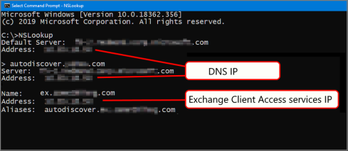

# Resolve common problems with the Intune Exchange connector

This article can help the Intune administrator resolve common problems with the operation of the Intune Exchange connector.

Before you start troubleshooting, review [Troubleshoot the Intune on-premises Exchange connector](troubleshoot-exchange-connector.md) for basic information about the connector. Also review common issues for the connector configuration.

## An Exchange ActiveSync device isn't discovered from Exchange

When an Exchange ActiveSync device isn't discovered from Exchange, [monitor the Exchange connector activity](/mem/intune/protect/exchange-connector-install#on-premises-intune-exchange-connector-high-availability-support) to see if the Exchange connector is syncing with the Exchange server. If no sync has happened since the device joined, collect the sync logs and attach them to a support request. If a full sync or quick sync has finished successfully since the device joined, check for the following issues:

- Make sure users have an Intune license. If not, the Exchange connector won't discover their devices.

- If the user's primary SMTP address is different from the user principal name (UPN) in Azure Active Directory (Azure AD), the Exchange connector won't discover any devices for that user. Fix the primary SMTP address to resolve the issue.

- If you have both Exchange 2010 and Exchange 2013 mailbox servers in your environment, we recommend pointing the Exchange connector to an Exchange 2013 Client Access server (CAS). If the Exchange connector is set up to communicate with an Exchange 2010 CAS, the Exchange connector won't discover any user devices on Exchange 2013.

- For Exchange Online Dedicated environments, you must point the Exchange connector to an Exchange 2013 CAS (not an Exchange 2010 CAS) in the dedicated environment during the initial setup. The connector will communicate only with an Exchange 2013 CAS when it executes PowerShell cmdlets.

## Problems with the notification email message

To support conditional access for on-premises mailboxes on devices that don't run Android Knox, make sure Intune enrollment starts from the "Get Started Now" email message that the Intune Exchange connector sends. Starting enrollment from the message ensures that the device receives a unique `ActiveSyncID` across all platforms (Exchange, Azure AD, Intune).

A user might not receive the notification email message because:

- The notification account was set up incorrectly.
- `Autodiscover` failed for the notification account.
- The Exchange Web Services (EWS) request to send the email message failed.

Review the following sections to troubleshoot email notification issues.

### Check the notification account that retrieves Autodiscover settings

1. Make sure the `Autodiscover` service and EWS are configured on the Exchange Client Access services. For more information, see [Client Access services](/Exchange/architecture/client-access/client-access) and [Autodiscover service in Exchange Server](/Exchange/architecture/client-access/autodiscover).

2. Verify that your notification account meets the following requirements:

   - The account has an active mailbox that's hosted by your Exchange on-premises server.

   - The account UPN matches the SMTP address.

3. Autodiscover requires a DNS server that has a DNS record for **Autodiscover.SMTPdomain.com** (for example Autodiscover.contoso.com) that points to your Exchange Client Access server. To check for the record, specify your FQDN in place of *Autodiscover.SMTPdomain.com* and follow these steps:

   1. At a command prompt, enter *NSLOOKUP*.

   2. Enter *Autodiscover.SMTPdomain.com*. The output should be similar to the following image:
      

   You can also test the Autodiscover service from the internet at [https://testconnectivity.microsoft.com](https://testconnectivity.microsoft.com). Or test it from a local domain by using the Microsoft Connectivity Analyzer tool. For more information, see [Microsoft Connectivity Analyzer tool](/connectivity-analyzer/microsoft-connectivity-analyzer-tool).

### Check Autodiscover

If Autodiscover fails, try the following steps:

1. [Configure a valid Autodiscover DNS record](/previous-versions/exchange-server/exchange-150/mt473798(v=exchg.150)).

2. Hard-code the EWS URL in the Intune Exchange connector configuration file:

   1. Determine the EWS URL. The default EWS URL for Exchange is `https://<mailServerFQDN>/ews/exchange.asmx`, but your URL might differ. Contact the Exchange administrator to verify the correct URL for your environment.

   2. Edit the *OnPremisesExchangeConnectorServiceConfiguration.xml* file. By default, the file is located in *%ProgramData%\Microsoft\Windows Intune Exchange Connector* on the computer that runs the Exchange connector. Open the file in a text editor, and then change the following line to reflect the EWS URL for your environment: `<ExchangeWebServiceURL>https://<YourExchangeHOST>/EWS/Exchange.asmx</ExchangeWebServiceURL>`

3. Save the file, and then restart the computer or restart the Microsoft Intune Exchange connector service.

>[!NOTE]
> In this configuration, the Intune Exchange connector stops using Autodiscover and instead connects directly to the EWS URL.

## Next steps

For help with specific errors, try [Resolve common errors for the Intune Exchange connector](troubleshoot-exchange-connector-common-errors.md).

To get support, or to get help from the Intune community:

- See [Get support](/mem/get-support) to use the Intune console to troubleshoot the issue or to open a support case with Microsoft.
- Post your issue in the [Microsoft Intune forums](/answers/products/mem).
