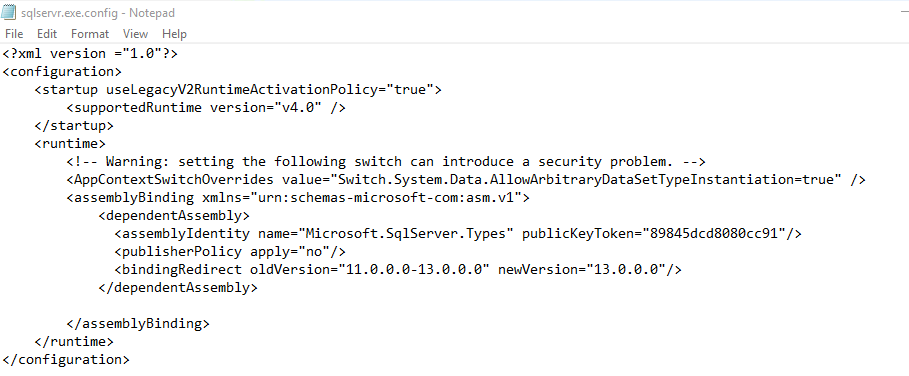

# Execution of SQL Server CLR fails with TypeInitializationException

This article helps you work around the problem where the execution of SQL Server CLR objects fails and returns a System.TypeInitializationException exception.

_Applies to:_ &nbsp; SQL Server  
_Original KB number:_ &nbsp; 4576575

## Symptoms

> [!IMPORTANT]
> This article contains information that shows you how to help lower security settings or how to turn off security features on a computer. You can make these changes to work around a specific problem. Before you make these changes, we recommend that you evaluate the risks that are associated with implementing this workaround in your particular environment. If you implement this workaround, take any appropriate additional steps to help protect the computer.

After you install an applicable .NET Framework update to fix a vulnerability that is described in [CVE-2020-1147](https://portal.msrc.microsoft.com/en-US/security-guidance/advisory/CVE-2020-1147), executing [Building Database Objects with Common Language Runtime (CLR) Integration](/sql/relational-databases/clr-integration/database-objects/building-database-objects-with-common-language-runtime-clr-integration) that read XML into either [DataSet and DataTable security guidance](/dotnet/framework/data/adonet/dataset-datatable-dataview/security-guidance) objects fails. This occurs because of a **System.TypeInitializationException** exception that has a nested **FileNotFoundException** exception. This problem indicates that the **System.Drawing** assembly could not be loaded.

For reference, see the following example:

> Msg 6522, Level 16, State 1, Procedure [your CLR object], Line 0 [Batch Start Line 0]
A .NET Framework error occurred during execution of user-defined routine or aggregate "your CLR object":  
System.TypeInitializationException: The type initializer for 'Scope' threw an exception. ---> System.IO.FileNotFoundException: Could not load file or assembly 'System.Drawing, Version=4.0.0.0, Culture=neutral,  PublicKeyToken=\<Token>' or one of its dependencies. The system cannot find the file specified.  
System.TypeInitializationException:  
at System.Data.TypeLimiter.Scope.IsTypeUnconditionallyAllowed(Type type)  
at System.Data.TypeLimiter.Scope.IsAllowedType(Type type)  
at System.Data.TypeLimiter.EnsureTypeIsAllowed(Type type, TypeLimiter capturedLimiter)
at System.Data.DataColumn.UpdateColumnType(Type type, StorageType typeCode)  
at System.Data.DataColumn..ctor(String columnName, Type dataType, String expr, MappingType type)  
at System.Data.XSDSchema.HandleElementColumn(XmlSchemaElement elem, DataTable table, Boolean isBase)  
at System.Data.XSDSchema.HandleParticle(XmlSchemaParticle pt, DataTable table, ArrayList tableChildren, Boolean isBase)  
at System.Data.XSDSchema.HandleComplexType(XmlSchemaComplexType ct, DataTable table, ArrayList tableChildren, Boolean isNillable)  
at System.Data.XSDSchema.InstantiateTable(XmlSchemaElement node, XmlSchemaComplexType typeNode, Boolean isRef)  
at System.Data.XSDSchema.HandleTable(XmlSchemaElement node)  
at System.Data.XSDSchema.HandleParticle(XmlSchemaParticle pt, DataTable table, ArrayList tableChildren, Boolean isBase)  
at System.Data.XSDSchema.HandleComplexType(XmlSchemaComplexType ct, DataTable table, ArrayList tableChildren, Boolean isNillable)  
at System.Data.XSDSchema.InstantiateTable(XmlSchemaElement node, XmlSchemaComplexType typeNode, Boolean isRef)  
at System.Data.XSDSchema.HandleTable(XmlSchemaElement node)  
at System.Data.XSDSchema.LoadSchema(XmlSchemaSet schemaSet, DataSet ds)  
at System.Data.DataSet.InferSchema(XmlDocument xdoc, String[] excludedNamespaces, XmlReadMode mode)  
at System.Data.Data...

## Resolution

This issue has been fixed in the October 13, 2020 republishing of the .NET Framework July 2020 Security-Only Updates.

For more information, including how to obtain the patch, see [.NET Framework republishing of July 2020 Security Only Updates](https://devblogs.microsoft.com/dotnet/net-framework-republishing-of-july-2020-security-only-updates/).

## Workaround

> [!WARNING]
> This workaround may make a computer or a network more vulnerable to attack by malicious users or by malicious software such as viruses. We do not recommend this workaround but are providing this information so that you can implement this workaround at your own discretion. Use this workaround at your own risk.

For applications that deserialize untrusted XML data into an instance of either `DataSet` or `DataTable` objects, we recommend that you use an alternative method to access the data. For applications that read only trusted XML data, you can try one of the following workarounds.

> [!NOTE]
> Workarounds 1 and 2 are preferred because the changes are made locally. Workaround 3 is system-wide.

> [!WARNING]
> These workarounds remove type restrictions for deserializing XML into instances of `DataSet` and `DataTable` objects. This may open a security hole if the application reads untrusted input.

- Workaround 1: Call AppContext.SetSwitch

    Change the start of the SQL CLR object code to set the **Switch.System.Data.AllowArbitraryDataSetTypeInstantiation** switch to **true**. You have to do this for every applicable SQL CLR object. See the following example.

    

    For more information, see [DataSet and DataTable security guidance](/dotnet/framework/data/adonet/dataset-datatable-dataview/security-guidance).

- Workaround 2: Create or change the *Sqlservr.exe.config* file for each applicable instance

    This workaround applies only to the instance itself.

    > [!IMPORTANT]
    > We cannot guarantee that this change will not be overwritten by SQL Server updates or instance upgrades. We recommend that you determine whether the change persists after an instance update or upgrade.

    1. Locate the *Sqlservr.exe.config* file in the [File Locations for Default and Named Instances of SQL Server](/sql/sql-server/install/file-locations-for-default-and-named-instances-of-sql-server):

       `%ProgramFiles%\Microsoft SQL Server\<Instance_ID>.<Instance Name>\MSSQL\Binn\`

    1. Within the `<runtime>` node, but outside any nested nodes, add the following line:

       ```xml
       <AppContextSwitchOverrides value="Switch.System.Data. AllowArbitraryDataSetTypeInstantiation=true"/>
       ```

    1. Save the file, and restart the instance.

       See the following example of a SQL Server 2016 instance.

       

- Workaround 3: Create the System.Drawing assembly

    Manually create the **System.Drawing** assembly in SQL Server from the DLL file in the **Global Assembly Cache (GAC)**, and then re-create assemblies that use either DataSet.ReadXML or DataTable.ReadXML. For example:

    ```sql
    CREATE ASSEMBLY [Drawing] FROM 'C:\Windows\Microsoft.NET\assembly\GAC_MSIL\System.Drawing\v4.0_4.0.0.0__b03f5f7f11d50a3a\System.Drawing.dll' WITH PERMISSION_SET = UNSAFE GO
    ```

- Workaround 4: Create a registry subkey

    > [!IMPORTANT]
    > Follow the steps in this workaround carefully. Serious problems might occur if you modify the registry incorrectly. Before you modify it, [back up the registry for restoration](https://support.microsoft.com/help/322756) in case problems occur.

    This workaround will affect all .NET applications on the server. Therefore, you should use this method only as a last resort if you cannot use the other workarounds.

    1. Open Registry Editor.

    1. Locate the following subkey:

       `KEY_LOCAL_MACHINE\SOFTWARE\Microsoft\.NETFramework\AppContext`  

    1. Create a REG_SZ value, as follows.

       |Name|Switch.System.Data.AllowArbitraryDataSetTypeInstantiation|
       |---|---|
       |Value|true|
       |||

    1. Restart all SQL Server instances.

       See the following example.

       

## More information

This problem is caused by the action of a recent .NET Framework security update to correct the .NET Framework XML content markup validation. SQL Server CLR objects that do not read XML into instances of either `DataSet` or `DataTable` objects will not be affected.
