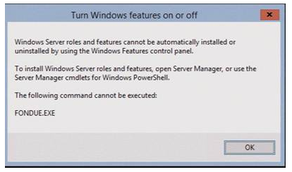
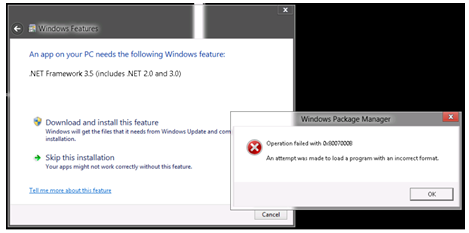
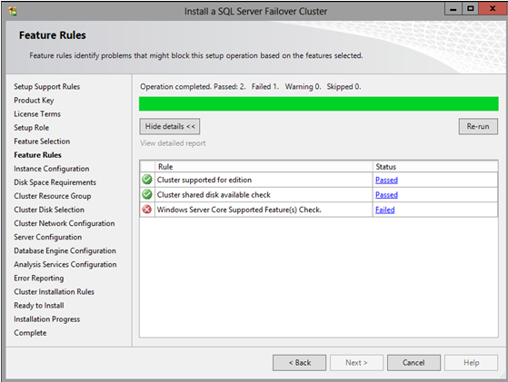
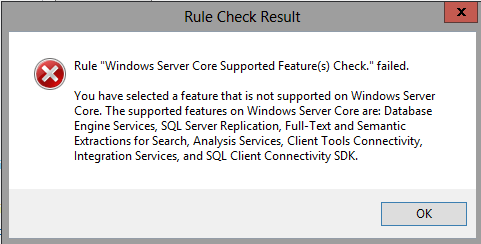

# Known SQL Server 2012 setup and migration issues

This article describes the SQL Server 2012 setup and migration issues.

_Original product version:_ &nbsp; SQL Server  
_Original KB number:_ &nbsp; 2681562

## Setup and migration issues that are specific to SQL Server 2012

- **General notes**

  - By default, Windows 8 includes the .NET Framework 4.0. Windows 8.1 and Windows Server 2012 R2 include the .NET Framework 4.5, and Windows 10 and Windows Server 2016 include the .NET Framework 4.6. However, the following SQL Server 2012 components depend on the .NET Framework 3.5:

    - SQL Server 2012 Database Engine
    - Replication Service
    - SQL Server Data Tools
    - Data Quality Service
    - Master Data Service
    - Reporting Service Native Mode
    - Full-Text Search

    Therefore, we recommend that you enable the .NET 3.5 Framework before you install SQL Server 2014 or SQL Server 2012 in a stand-alone or clustered environment to help prevent any possible SQL Server setup failures.

    For information about how to enable the .NET 3.5 Framework, review the following articles:

    - [Install the .NET Framework 3.5 on Windows 10, Windows 8.1, and Windows 8](/dotnet/framework/install/dotnet-35-windows-10).

    - [Enable .NET Framework 3.5 by using the Add Roles and Features Wizard](/windows-hardware/manufacture/desktop/enable-net-framework-35-by-using-the-add-roles-and-features-wizard)  

- Some SQL Server 2012 installation and setup issues are fixed in the latest cumulative updates for SQL Server 2012. Therefore, we recommend that you create a slipstream installation package that includes SQL Server 2012 and CU3 or a later update using [/Update parameter](/sql/database-engine/install-windows/install-sql-server-from-the-command-prompt#Upgrade). For more information about how to do this, see [SQL Server 2012 Setup just got smarter](https://techcommunity.microsoft.com/t5/sql-server-support/sql-server-2012-setup-just-got-smarter-8230/ba-p/317440) or [How to patch SQL Server 2012 Setup with an updated setup package (using UpdateSource to get a smart setup)](/archive/blogs/jason_howell/how-to-patch-sql-server-2012-setup-with-an-updated-setup-package-using-updatesource-to-get-a-smart-setup).

## SQL Server 2012 setup issues that can occur when the .NET Framework 3.5 is not enabled

- **Issue 1 - Incomplete SQL Failover Cluster or Stand-alone installations**

  Symptoms

  On servers where the .NET Framework 3.5 is not already installed or servers where Internet access is restricted, the SQL Server 2012 installation program does not install components that depend on the .NET Framework 3.5. Therefore, the SQL Server 2012 installation may be incomplete.

  > [!NOTE]
  > Windows 8.1 or Windows Server 2012 R2 will not let you continue with the installation.

  An error message that resembles the following may be displayed during SQL Server 2012 installation when the .NET Framework is not enabled.

  

  Prevention

  To prevent this issue, enable the .NET Framework 3.5 on all nodes of the cluster or on the stand-alone server before you install SQL Server 2012.

  Resolution

  To resolve this issue on a stand-alone server, enable the .NET Framework 3.5, and then run Setup again to add the additional features.

  To resolve this issue in a clustered environment, uninstall the incomplete SQL Server 2012 instances, enable the .NET Framework 3.5, and then reinstall SQL Server 2012.

  > [!NOTE]
  > In a clustered environment, you cannot add the features that were skipped by running SQL Server 2012 Setup again.

  To resolve this issue on a stand-alone server, enable the .NET Framework 3.5, and then run SQL Server Setup again.

- **Issue 2 - Users incorrectly are prompted to download and install the .NET Framework 3.5**

  Symptoms

  Users incorrectly may be prompted to download and install the .NET Framework 3.5 when they try to install CU1 or CU2. This issue can occur even though the installed components do not depend on the .NET Framework 3.5.

  In this situation, users may receive an error message that resembles the following.

  

  Cause

  This is a known issue in SQL Server 2012 CU1 and CU2.

  > [!NOTE]
  > This issue is fixed in Cumulative Update 3 for SQL Server 2012 and later versions.

  Prevention

  To prevent this issue, do one of the following:

  - Enable the .NET Framework 3.5, apply the CU1 update package or the CU2 update package, and then disable the .NET Framework 3.5.

  > [!NOTE]
  > You should only disable the .NET Framework 3.5 if your installation does not include components that depend on the .NET Framework 3.5.

  - Install SQL Server 2012 from a slipstreamed installation package that includes SQL Server 2012 and CU3 or a later version.
  - Apply Cumulative Update 3 or a later version. For more information, see [The SQL Server 2012 builds that were released after SQL Server 2012 was released](https://support.microsoft.com/help/2692828).

- **Issue 3 - Windows application compatibility mode alerts are displayed during a silent install**

  Symptoms

  In Windows 8.1, Windows 8, Windows Server 2012 R2, Windows Server 2012, Windows 10, and Windows Server 2016, the .NET Framework is a Feature-On-Demand (FOD) component. Additionally, the Windows 10, Windows 8.1 and Windows 8 system policies and the Windows Server 2016, Windows Server 2012 R2 and Windows Server 2012 system policies require users to be alerted when FOD components are enabled.

  > [!NOTE]
  > By default, the .NET Framework 4.0 is enabled in Windows 8 and Windows Server 2012. Additionally, the .NET Framework 4.5 is enabled in Windows 8.1 and Windows Server 2012 R2, and the .NET Framework 4.6 is enabled in Windows 10 and Window Server 2016. However, the .NET Framework 3.5 is disabled.

  Therefore, a program compatibility mode warning that prompts users to download and install the .NET Framework 3.5 may be displayed during a silent install. These program compatibility alerts cannot be suppressed. Screenshots of warnings are shown as follows:

  Windows Server 2012 R2 and Windows Server 2012 - Full Server

  

  Windows Server 2012 R2 and Windows Server 2012 - Server Core

  

  Prevention

  To prevent this issue, the user can enable the .NET Framework 3.5 before they perform a silent installation.

## Additional SQL Server 2012 setup issues

- **Issue 1: A .NET Framework unhandled exception may be generated when you try to install a second instance of SQL Server 2012**

  Symptoms

  Consider the following scenario:

  - You install an instance of SQL Server 2012.
  - A .NET Framework 4.0 user configuration file is created when you install the instance of SQL Server 2012. Additionally, the .NET Framework 3.5 is enabled during the installation.
  - You try to install a second instance of SQL Server 2012.
  
  In this scenario, an unhandled exception may be generated. You may receive an error message that resembles the following:
  
  > An error occurred creating the configuration section handler for userSettings/Microsoft.SqlServer.Configuration.LandingPage.Properties.Settings: Could not load file or assembly System, Version=4.0.0.0, Culture=neutral, PublicKeyToken=xxxxx or one of its dependencies. The system cannot find the file specified. (C:\Users\Administrator\AppData\Local\Microsoft_Corporation\LandingPage.exe_StrongName_ ryspccglaxmt4nhllj5z3thycltsvyyx\11.0.0.0\user.config)

  Cause

  In Windows 8 and Windows Server 2012, this issue occurs because the .NET Framework 4.0 is enabled by default in Windows 8 and Windows Server 2012. Therefore, a .NET Framework 4.0 user configuration file is created when you install SQL Server 2012. Additionally, the .NET Framework 3.5 is enabled during the installation.

  When you try to install the second instance of SQL Server 2012, the installation uses the .NET Framework 2.0 because the .NET Framework 3.5 is already installed. This conflicts with the setting in the user configuration file cause the unhandled exception.

  In Windows 8.1 and Windows Server 2012 R2, this issue occurs because the .NET Framework 4.5 is enabled by default in Windows 8.1 and Windows Server 2012 R2. Therefore, a .NET Framework 4.5 user configuration file is created when you install SQL Server 2012. Additionally, the .NET Framework 3.5 is enabled during the installation.

  When you try to install the second instance of SQL Server 2012, the installation uses the .NET Framework 2.0 because the .NET Framework 3.5 is already installed. This conflict with the setting in the user configuration causes the unhandled exception.

  In Windows 10 and Windows Server 2016, this issue occurs because the .NET Framework 4.6 is enabled by default. Therefore, a .NET Framework 4.6 user configuration file is created when you install SQL Server 2012. Additionally, the .NET Framework 3.5 is enabled during the installation.

  When you try to install the second instance of SQL Server 2012, the installation uses the .NET Framework 2.0 because the .NET Framework 3.5 is already installed. This conflicts with the setting in the user configuration file cause the unhandled exception.

  Prevention

  To prevent this issue, delete the *User.config* file in the following folder before you install the second instance of SQL Server 2012:

  `%userprofile%\AppData\Local\Microsoft_Corporation\LandingPage.exe_StrongName_ryspccglaxmt4nhllj5z3thycltsvyyx\11.0.0.0`

  Resolution

  > [!NOTE]
  > This issue is fixed in Microsoft SQL Server 2012 Service Pack 1 (SP1).

  If the first instance already has Service Pack 1 installed, you should not experience this issue. If you cannot install Service Pack 1 on the first instance, do one of the following:

  - Install the second SQL Server 2012 instance from a [slipstreamed installation package](https://www.microsoft.com/download/details.aspx?id=35575) that includes SQL Server 2012 and Microsoft SQL Server 2012 Service Pack 1. After installation of the new instance, you must apply SQL Server 2012 Service Pack 4 or a later update. For more information, see [How to obtain the latest service pack for SQL Server 2012](https://support.microsoft.com/help/2755533).

  - Pre-patch by using the SQL Server 2012 SP4 files and then install SQL Server 2012:

    - On a computer where SQL Server 2012 RTM is not installed:

        1. Download and install [SQL Server 2012 SP4](https://www.microsoft.com/download/details.aspx?id=56040).

        2. On the License Terms screen, click the **I accept the license terms** check box and then click **Next**.

           > [!NOTE]
           > The setup files are installed and the installation wizard automatically close.

        3. Verify the installation. To do this, start **Add or Remove Programs** and verify that the following are listed:

           - Microsoft SQL Server 2012 Setup, version 11.0.7001.0
           - Two entries for Microsoft Visual C++.

    - On a computer that has an existing instance of SQL Server 2012 RTM:

        1. Download and install [SQL Server 2012 SP4](https://www.microsoft.com/download/details.aspx?id=56040).
        2. Extract the SP4 files to a local folder. For example, extract the SP4 files to `c:\sp4`.

           > [!NOTE]
           > You cannot run SQL Server 2012 SP4 setup in this scenario.

        3. In the folder that you extracted the SP4 files to, double-click **SqlSupport.msi** and then click **Yes**.
        4. Verify the installation. To do this, start **Add or Remove Programs** and verify that Microsoft SQL Server 2012 Setup, version 11.0.7001.0 is listed.

    > [!NOTE]
    > Check the **Installation Instructions** section on the SQL Server 2012 SP4 download page to determine the correct download for your server.

- **Issue 2: You cannot install a SQL Server 2012 Failover Cluster with the File Stream Share feature enabled on Windows Server 2012 R2 or Windows Server 2012**

  Symptoms

  You may receive an error message that resembles the following when you try to install a new SQL Server 2012 Failover Cluster with the `FileStream` Share feature enabled on Windows Server 2012:
  
  > There was an error setting private property 'Security0x20Descriptor' to value 'System.Byte[]' for resource 'SQL Server Filestream share (FILESTREAM)'. Error: There was a failure to call cluster code from a provider. Exception message: Not found.

  Cause

  This issue occurs because support for the Security Descriptor property was dropped in Windows Server 2012.

  Prevention

  To prevent this issue, install the failover cluster without the `FileStream` Share feature enabled. After the installation is complete, enable the `FileStream` Share feature.

  Resolution

  > [!NOTE]
  > This issue is fixed in Microsoft SQL Server 2012 Service Pack 1 (SP1).

  To resolve this issue, uninstall the failed cluster instance by using **Add or Remove Programs**, and then install the failover cluster without the `FileStream` Share feature enabled. After the installation is complete, enable the `FileStream` Share feature.

- **Issue 3: Error during SQL Server 2012 installation: "An attempt was made to load a program with an incorrect format"**

  Symptoms

  Consider the following scenario:

  - You install a 64-bit version of Windows 10, Windows 8.1 or Windows 8.
  - You try to install SQL Server 2012 in Windows-on-Windows (WoW) mode.
  - The SQL Server 2012 installation includes Reporting Services.

  In this scenario, the installation fails. Additionally, you receive an error message that resembles the following:

    > Operation failed with 0x8007000B  
    An attempt was made to load a program with an incorrect format.

    

    Prevention

    To prevent this issue, install the IIS ASP.NET 3.5 component by using Server Manager before you install SQL Server 2012. For more information, see [ASP.NET 2.0 and ASP.NET 3.5 do not work after you uninstall ASP.NET 4.5 in Windows 8 or Windows Server 2012](https://support.microsoft.com/help/2748719).

- **Issue 4: You cannot install a SQL Server 2012 Enterprise Edition failover cluster instance**

  Symptoms
  
  Consider the following scenario:
  
  - You do one of the following:
  
    - You create a slipstreamed installation package that includes SQL Server 2012 and CU1.
    - You pre-patch by using CU1 before you install SQL Server 2012.
  
  - You install SQL Server 2012 by using the **UIMODE=EnableUIOnServerCore** option.
  
  In this scenario, the installation fails. You receive an error message that resembles the following.
  
  
  
  The details of the error resemble the following.
  
  
  
  Cause
  
  This issue occurs because the `DQ` feature is implicitly selected together with the Engine component during the installation.
  
  > [!NOTE]
  > The `DQ` feature is not supported in Server Core mode.
  
  Resolution
  
  > [!NOTE]
  > The issue is fixed in SQL Server 2012 RTM CU3 and SQL Server 2012 Service Pack 1.
  
  To resolve this issue, do one of the following:
  
  - Create a slipstreamed installation package that includes SQL Server 2012 and CU3.
  - Pre-patch the setup support files by running the CU3 installation package.

- **Issue 5: Error message when you try to upgrade the cluster node to SQL Server 2012: "The common properties for resource 'SQL Network Name (\<SQL Name>) could not be saved"**

  For more information about this issue and how to resolve it, see ["The common properties for resource 'SQL Network Name ()' could not be saved" error when you try to upgrade the cluster node to SQL Server 2012](https://support.microsoft.com/help/2782511).

- **Issue 6: Error message when you use the OpenSQLFileStream API: "System.ComponentModel.Win32Exception (0x80004005): The request is not supported."**

  Symptoms
  
  Consider the following scenario:
  
  - You install an instance of SQL Server 2008 R2 on a server that is running Windows Server 2012.
  - You upgrade the instance of SQL Server 2008 R2 to SQL Server 2012 Service Pack 1 (SP1).
  - You use the `OpenSQLFileStream` API.
  
In this scenario, you receive an error message that resembles the following:
  
  > System.ComponentModel.Win32Exception (0x80004005): The request is not supported.
  
  Cause
  
  This issue occurs because the SQL Server 2012 upgrade incorrectly deletes the following registry key:

  `HKEY_LOCALMACHINE\System\CurrentControlSet\Services\LanmanServer\Parameters\FsctlAllowList\FSCTL_SQL_FILESTREAM_FETCH_OLD_CONTENT`  
  
  Workaround
  
  To work around this issue, use Registry Editor to re-create the following registry key:

  ```console
  HKLM\System\CurrentControlSet\Services\LanmanServer\Parameters\FsctlAllowList
  Dword: FSCTL_SQL_FILESTREAM_FETCH_OLD_CONTENT
  Value: 0x92560
  ```

### References

- For more information about how to deploy the .NET Framework 3.5, see [Microsoft .NET Framework 3.5 Deployment Considerations](/previous-versions/windows/it-pro/windows-8.1-and-8/dn482066(v=win.10)).

- For more information about how to use ASP.NET 3.5 and ASP.NET 4.5 in IIS 8.0, see [IIS 8.0 Using ASP.NET 3.5 and ASP.NET 4.5](/iis/get-started/whats-new-in-iis-8/iis-80-using-aspnet-35-and-aspnet-45).

- For information about issues that can occur after you install ASP.NET 4.5, see [ASP.NET 2.0 and ASP.NET 3.5 do not work after you uninstall ASP.NET 4.5 in Windows 8 or Windows Server 2012](/troubleshoot/aspnet/aspnet-35-aspnet-2-not-work).

- For more information about how to install fail over clustering in Windows Server 2012, see [Installing the Failover Cluster Feature and Tools in Windows Server 2012](https://techcommunity.microsoft.com/t5/failover-clustering/installing-the-failover-cluster-feature-and-tools-in-windows/ba-p/371733).

### See Also

[Understand the .NET Framework requirements for various versions of SQL Server](/troubleshoot/sql/install/understanding-dotnet-framework-requirements).