# Reporting Services Server cannot connect to the DPM database error when you schedule an email report

This article helps you work around an issue where you receive the **Reporting Services Server cannot connect to the DPM database** error when you try to schedule a report to be emailed in Data Protection Manager (DPM).

_Original product version:_ &nbsp; System Center Data Protection Manager  
_Original KB number:_ &nbsp; 4457489

## Symptoms

Assume that you do a new installation, or you upgrade to Microsoft System Center 2012 R2 Data Protection Manager or a later version. When you try to schedule a report to be emailed, you receive the following error message:

> Reporting Services Server cannot connect to the DPM database.  
> To repair the configuration, follow steps for repairing DPM from DPM Setup Help.  
> ID: 3001

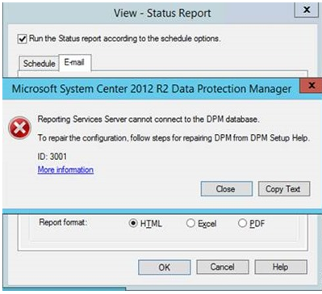

When you try the steps that are mentioned in [Repair DPM](/previous-versions/system-center/system-center-2012-R2/hh758162(v=sc.12)), this problem isn't resolved.

## Workaround

To work around this problem, follow these steps to make correct configuration changes that will enable Data Protection Manager reports to be emailed.

> [!NOTE]
> Some steps may not be necessary if you experience this problem after you upgrade from System Center 2012 Data Protection Manager Server Pack 1. Review and do these steps as applicable.

1. On the DPM server, create a local group that's named **DPMDBReaders$\<*DPMServerName*>**. In the following example, the <*DPMServerName*> value is *WINB-DPM*.

    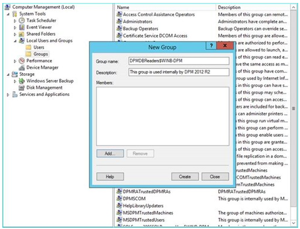

2. Create a local user that's named **DPMR$\<*DPMServerName*>**, and provide a strong password that never expires.

    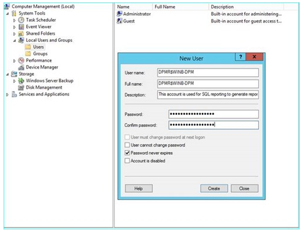

3. Add the new local user to the **DPMDBReaders$<*DPMServerName*>** group that was created in step 1.

    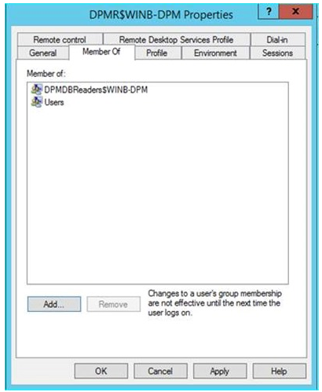

4. Start SQL Server Management Studio by using administrative permissions, and then connect to the SQL Server instance that's used by DPM. Under **Security**, right-click **Logins**, and then select **New login**. Browse to add the local group **DPMDBReaders$\<*DPMServerName*>**. After the group is added, it will be listed under **Logins**.

    

5. Right-click the new login group, and then select **Properties**. In the **General** section, change the **Default database** field to the DPMDB name.

    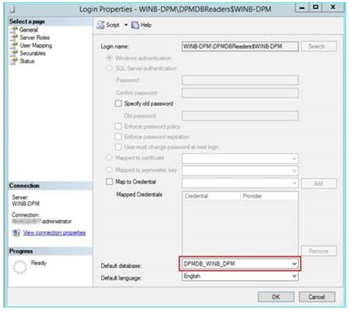

6. Under **User Mapping**, select both the check box for the DPMDB name and the check box for the `db_datareader` role.

    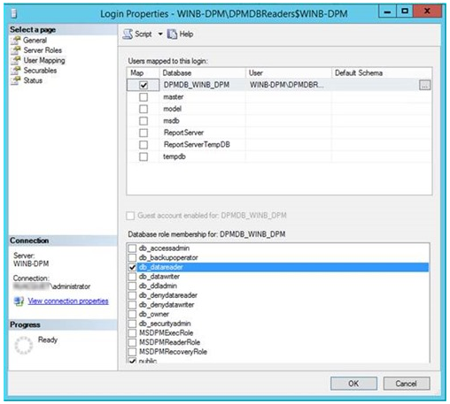

7. In SQL Server Management Studio, browse to **Databases** > **DPMDB** > **Security** > **Users**, and then select the **DPMDBReaders$\<*DPMServerName*>** group.

    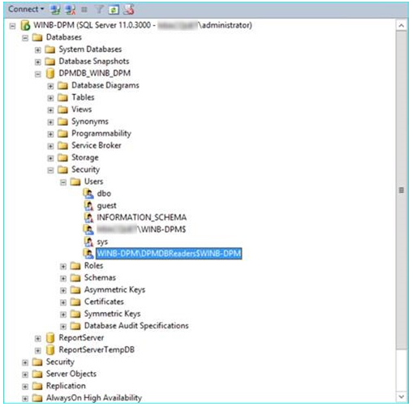

8. Right-click the **DPMDBReaders$\<*DPMServerName*>** group, and then select **Properties**.
9. Under **Securables**, select **Search**. In the **Add Objects** dialog box, select **OK**.
10. In the **Select Objects** dialog box, select the **Objects** type, and then select the **Stored Procedure** check box. Add the following stored procedures:

    - Prc_MOM_Heartbeat_Get
    - prc_MOM_ProductionServer_Get

    Grant the **Execute** permission to both stored procedures.

    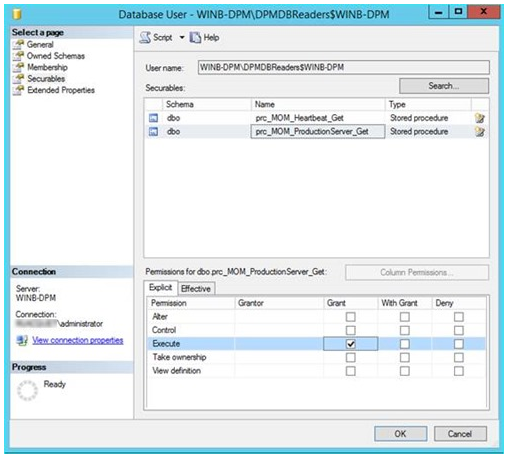

11. Exit SQL Server Management Studio.
12. Start Reporting Services Configuration Manager, and then select **Web Portal URL**.

    

13. Click the **URLs** link, as shown in step 12. This opens the `https://localhost/Reports/Pages/Folder.aspx` portal, as shown in the following screenshot.

    

14. Click the `DPMReports_<GUID>` link to open the DPM reports page, as shown in the following screenshot.

    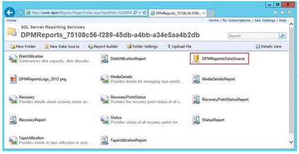

15. Select **DPMReporterDataSource** from step 14 to open its properties window, as shown in the following screenshot.

    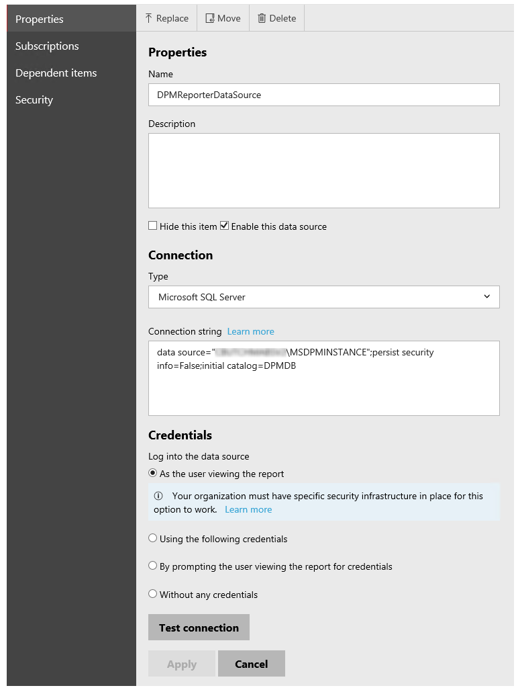

16. On the **DPMReporterDataSource** configuration page, follow these steps:

    1. Select the **Using the following credentials** option.
    2. Change the **Type of credentials** list selection  to **Windows user name and password**.
    3. Add the **DPMR$\<*DPMServerName*>** user account and password that you created in step 2.
    4. Select **Test connection** to determine whether the server can connect successfully.
    5. Select **Apply**.

    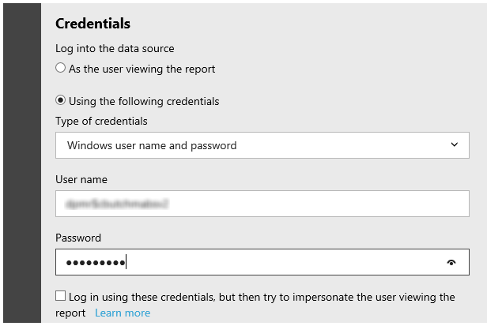

17. Close the **DPMReporterDataSource** configuration page to return to the **Reporting Services Configuration Manager** screen. Select **Service Account**. On **Service Account** page, change the **Report Server Service Account** service to use **Network Service**. If you're prompted for the backup encryption key, type the value, and then select **Apply**.

    

18. Restart the DPM server to make sure that all configuration changes take effect.
19. Now, you can schedule email reports without experiencing the original error that's mentioned in the [Symptoms](#symptoms) section.

    
