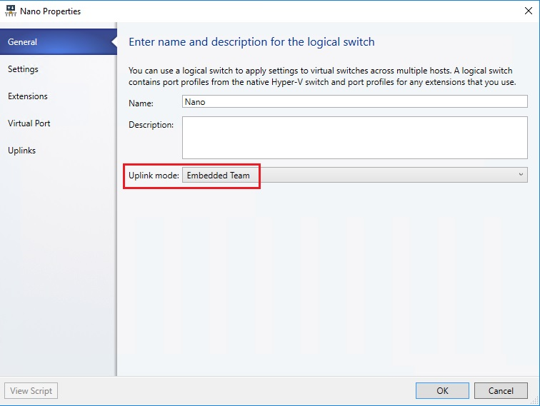
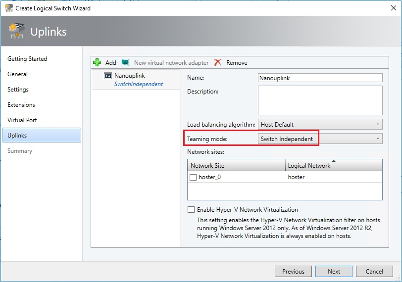

# How to create the logical switch on Nano Servers through VMM 2016

This article describes how to create logical switches on Nano Servers through System Center 2016 Virtual Machine Manager.

_Original product version:_ &nbsp; System Center 2016 Virtual Machine Manager  
_Original KB number:_ &nbsp; 4464073

## Introduction

Nano Server is optimized as a lightweight operating system for running cloud-native applications based on containers and micro-services or as an agile and cost-effective datacenter host with a dramatically smaller footprint, there are important differences in Nano Server versus Server Core or Server with Desktop Experience installations.

> [!NOTE]
> This blog is to address the **Uplink mode** and **Teaming mode** for Nano Server. Rest of the logical switch concept remains same. For more information on logical switch creation, go through [Create logical switches](/system-center/vmm/network-switch).

On Nano Server, NIC teaming (specifically, load balancing and failover, or LBFO) is not supported. Switch-embedded teaming (SET) is supported instead.

[Install Nano Server](/windows-server/get-started/getting-started-with-nano-server?redirectedfrom=MSDN)

## Create the logical switch on Nano Servers

So we need to create logical switch in SCVMM considering the above constraint:

1. Sign in to SCVMM console, and then go to **Fabric** > **Networking** > **Logical switch**.
2. Select **Create new logical switch**, and then provide the name for logical switch. Select **Uplink mode** as **Embedded Team**.

   

3. Go through the wizard and select the required options.

   1. In **Uplinks** option, click **Add New Uplink Port Profile** and provide the name for the profile.
   2. Select the **Teaming mode** as **Switch Independent** because Nano supports only switch independent. Below is reference article:

      [Remote Direct Memory Access (RDMA) and Switch Embedded Teaming (SET)](/windows-server/virtualization/hyper-v-virtual-switch/RDMA-and-Switch-Embedded-Teaming?redirectedfrom=MSDN)

      Another key difference between NIC teaming and SET is that NIC teaming provides the choice of three different teaming modes, while SET supports only **Switch Independent** mode.

      

4. Now we can apply the above logical switch to the Nano host managed by SCVMM.

If we select other **Teaming mode** as show below e.g. LACP, we will get an error while applying to Nano host:

> Error (2912)  
> An internal error has occurred trying to contact the 'nano.hoster.lab' server: : .  
> WinRM: URL: `http://nano.hoster.lab:5985/`, Verb: [INVOKE], Method: [GetFinalResult], Resource: `https://schemas.microsoft.com/wbem/wsman/1/wmi/root/scvmm/AsyncTask?ID=1004`
> Unknown error (0x80078005)
>
> Recommended Action  
> Check that WS-Management service is installed and running on server 'nano.hoster.lab'. For more information use the command "winrm helpmsg hresult". If 'nano.hoster.lab' is a host/library/update server or a PXE server role then ensure that VMM agent is installed and running. Refer to [https://support.microsoft.com/help/2742275](https://support.microsoft.com/help/2742275) for more details.
