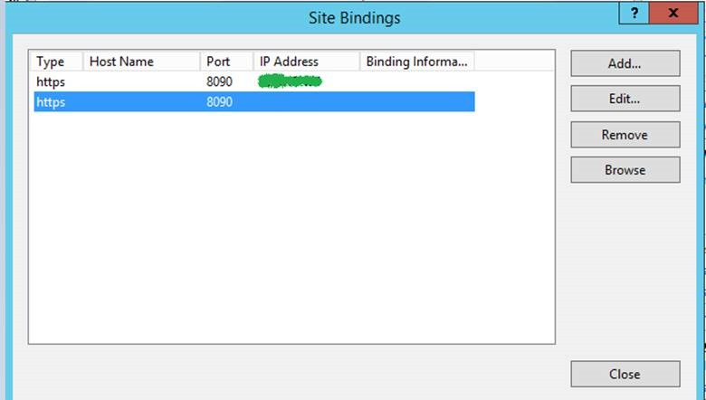

# Plan Out Of Sync and Quota update failed errors in Windows Azure Pack Admin Portal

This article helps you fix an issue where you receive the **Plan Out Of Sync** and **Quota update failed** errors when you delete users or subscriptions in the Windows Azure Pack (WAP) Admin Portal.

_Original product version:_ &nbsp; Microsoft System Center 2012 R2 Virtual Machine Manager, Windows Azure Pack (on Windows Server 2012 R2), System Center 2012 Virtual Machine Manager  
_Original KB number:_ &nbsp; 3056677

## Symptoms

When you try to delete users or subscriptions in the Windows Azure Pack (WAP) Admin Portal, the action may fail. Errors that you may receive include **Plan Out Of Sync** and **Quota update failed** messages. When you try to delete a subscription, you may also receive a **There is no subscription associated with the tenant** error.

Debug logs will contain errors that resemble the following:

> One or more errors occurred while contacting the underlying resource providers. The operation may be partially completed.

> Details: Failed to create subscription. Reason: Message :

-or -

> Failed to delete subscription. Reason: Message : The underlying connection was closed: An unexpected error occurred on a send., InnerMessage: Unable to read data from the transport connection: An existing connection was forcibly closed by the remote host.

Error messages that refer to blank subscription IDs may also indicate this state. (These error messages are presented as **SubscriptionID=[]**.)

## Cause

This issue can occur if multiple bindings exist for port 8090 in the Internet Information Server (IIS) settings of the Service Provider Foundation (SPF) server.

## Resolution

To resolve this issue, verify that the bindings for port 8090 on the SPF server are correct. By default, a single HTTPS binding on port 8090 should exist. If multiple bindings exist, remove any duplicate entries, and verify that the binding is set to listen on all IP addresses.

In the following screenshot, two bindings exist. The second entry for HTTPS 8090 should be removed.

## More Information

Debug logging may show errors that resemble the following:

> 2 [0]0D2C.0754::‎2015‎-‎03‎-‎27 15:09:21.042 [ActivityEventSource]Started activity [HttpRequestActivity, id {8ab952bd-c43f-4ded-b173-50d4055f9341}] parent activity [WebAuthentication Call, id {4659b10b-cf3a-4bcc-9769-f6e1b8663fe5}] Elapsed: 0ms Context: {c477a2fb-8864-4d89-96c7-24bdccee5b94} Properties: RequestUrl=[https://wapserver.contoso.local:8090/provider/subscriptions] & x-ms-client-request-id=[e8dbc04c-5381-40ba-8909-69b83a4f3f13] & x-ms-client-session-id=[99459df3-bb71-4f30-9315-1b0c6c916a58]

> 3 [0]0D2C.0754::‎2015‎-‎03‎-‎27 15:09:21.058 [ActivityEventSource]Successfully completed activity [HttpRequestActivity, id {8ab952bd-c43f-4ded-b173-50d4055f9341}] parent activity [WebAuthentication Call, id {4659b10b-cf3a-4bcc-9769-f6e1b8663fe5}] Elapsed: 0ms Context: {c477a2fb-8864-4d89-96c7-24bdccee5b94} Duration: 124ms Properties: OriginalPath=[/provider/subscriptions] & RequestUrl=[https://wapserver.contoso.local:8090/provider/subscriptions] & SubscriptionId=[] & x-ms-client-request-id=[e8dbc04c-5381-40ba-8909-69b83a4f3f13] & x-ms-client-session-id=[99459df3-bb71-4f30-9315-1b0c6c916a58]

> 4 [1]0D2C.0754::‎2015‎-‎03‎-‎27 15:09:24.406 [Microsoft-ServiceProviderFoundation]Component: Provider Activity [WebAuthentication Call, id {4659b10b-cf3a-4bcc-9769-f6e1b8663fe5}] Parent activity [none, id {00000000-0000-0000-0000-000000000000}] Elapsed: 0ms Context: {c477a2fb-8864-4d89-96c7-24bdccee5b94} Creating Tenant and linking to stamp TenantName: user.name@contoso.com_a7c63b17-c0fb-48bf-bdc4-5f7db1c2610b

> 5 [0]0D2C.0754::‎2015‎-‎03‎-‎27 15:09:24.484 [Microsoft-ServiceProviderFoundation]Component: Provider Activity [WebAuthentication Call, id {4659b10b-cf3a-4bcc-9769-f6e1b8663fe5}] Parent activity [none, id {00000000-0000-0000-0000-000000000000}] Elapsed: 0ms Context: {c477a2fb-8864-4d89-96c7-24bdccee5b94} Failed to delete subscription. Reason: Message : The underlying connection was closed: An unexpected error occurred on a send., InnerMessage: Unable to read data from the transport connection: An existing connection was forcibly closed by the remote host.

> 6 [0]0D2C.0754::‎2015‎-‎03‎-‎27 15:09:24.489 [Microsoft-ServiceProviderFoundation]Component: Provider Activity [WebAuthentication Call, id {4659b10b-cf3a-4bcc-9769-f6e1b8663fe5}] Parent activity [none, id {00000000-0000-0000-0000-000000000000}] Elapsed: 0ms Context: {c477a2fb-8864-4d89-96c7-24bdccee5b94} at System.Net.HttpWebRequest.GetResponse() at System.Data.Services.Client.WebUtil.GetResponseHelper(ODataRequestMessageWrapper request, DataServiceContext context, IAsyncResult asyncResult, Boolean handleWebException) at System.Data.Services.Client.QueryResult.ExecuteQuery(DataServiceContext context) at System.Data.Services.Client.DataServiceRequest.Execute[TElement](DataServiceContext context, QueryComponents queryComponents) at System.Data.Services.Client.DataServiceQuery\`1.Execute() at System.Data.Services.Client.DataServiceQuery\`1.GetEnumerator() at System.Linq.Enumerable.FirstOrDefault[TSource](IEnumerable\`1 source) at System.Data.Services.Client.DataServiceQueryProvider.ReturnSingleton[TElement](Expression expression) at System.Linq.Queryable.FirstOrDefault[TSource](IQueryable\`1 source) at Microsoft.SystemCenter.Foundation.Provider.SubscriptionResourceProvider.DeleteSubscription(String id)

> 7 [0]0D2C.0754::‎2015‎-‎03‎-‎27 15:09:24.490 [Microsoft-ServiceProviderFoundation]Component: Provider Activity [WebAuthentication Call, id {4659b10b-cf3a-4bcc-9769-f6e1b8663fe5}] Parent activity [none, id {00000000-0000-0000-0000-000000000000}] Elapsed: 0ms Context: {c477a2fb-8864-4d89-96c7-24bdccee5b94} The underlying connection was closed: An unexpected error occurred on a send.

> 8 [0]0D2C.0754::‎2015‎-‎03‎-‎27 15:09:24.491 [Microsoft-ServiceProviderFoundation]Component: Provider Activity [WebAuthentication Call, id {4659b10b-cf3a-4bcc-9769-f6e1b8663fe5}] Parent activity [none, id {00000000-0000-0000-0000-000000000000}] Elapsed: 0ms Context: {c477a2fb-8864-4d89-96c7-24bdccee5b94} Message : The underlying connection was closed: An unexpected error occurred on a send., InnerMessage: Unable to read data from the transport connection: An existing connection was forcibly closed by the remote host.

For more information about debug logging, see the following articles:

- [Debug Logging in System Center Service Provider Foundation (SPF)](https://support.microsoft.com/help/2850280)
- [How to enable debug logging in Virtual Machine Manager](https://support.microsoft.com/help/2913445)
