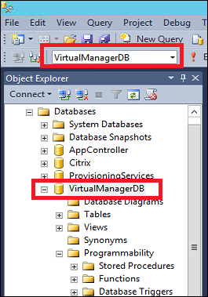
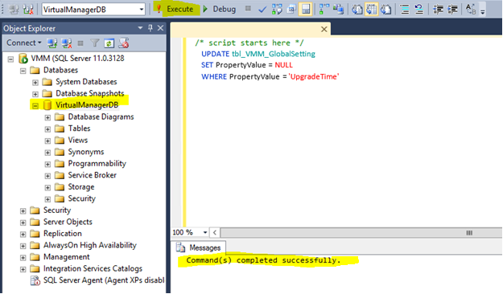

# The Virtual Machine Manager console doesn't start and you receive error ID 1602

This article fixes an issue in which error ID 1602 occurs when you start the Virtual Machine Manager (VMM) console.

_Original product version:_ &nbsp; Microsoft System Center 2012 R2 Virtual Machine Manager, System Center 2012 Virtual Machine Manager  
_Original KB number:_ &nbsp; 3020448

## Symptoms

When you try to start the VMM console in System Center 2012 Virtual Machine Manager or later versions, the console doesn't start and you receive the following error message:

> Unable to connect to the VMM Management server *server_name*. The Virtual Machine Manager service on that server did not respond. Verify that Virtual Machine Manager has been installed on the server and that the Virtual Machine Manager service is running. Then try to connect again. If the problem persists, restart the Virtual Machine Manager service.
ID: 1602

You may also notice that the System Center Virtual Machine Manager service is stopped. When you try to start the service, you receive the following error message:

> Windows could not start the System Center Virtual Machine Manager service on Local Computer. The service did not return an error. This could be an internal Windows error or an internal service error. If the problem persists, contact your system administrator.

Additionally, an error that resembles the following is logged in the Application log on the Virtual Machine Manager server:

> Log Name: Application  
> Source: .NET Runtime  
> Date:  
> Event ID: 1026  
> Task Category: None  
> Level: Error  
> Keywords: Classic  
> User: N/A  
> Computer:  
> Description:  
> Application: vmmservice.exe  
> Framework Version: v4.0.30319  
> Description: The process was terminated due to an unhandled exception.  
> Exception Info: System.FormatException  
> Stack:  
> at System.DateTime.Parse(System.String, System.IFormatProvider)  
> at System.Convert.ToDateTime(System.String)  
> at Microsoft.VirtualManager.DB.ServerGlobalSettings.ReadServerData(System.Guid)  
> at Microsoft.VirtualManager.DB.ServerGlobalSettings.get_Instance()  
> at Microsoft.VirtualManager.Engine.VirtualManagerService.StartSQL()  
> at Microsoft.VirtualManager.Engine.VirtualManagerService.ExecuteRealEngineStartup()  
> at Microsoft.VirtualManager.Engine.VirtualManagerService.TryStart(System.Object)  
> at System.Threading.ExecutionContext.RunInternal(System.Threading.ExecutionContext, System.Threading.ContextCallback, System.Object, Boolean)  
> at System.Threading.ExecutionContext.Run(System.Threading.ExecutionContext, System.Threading.ContextCallback, System.Object, Boolean)  
> at System.Threading.TimerQueueTimer.CallCallback()  
> at System.Threading.TimerQueueTimer.Fire()  
> at System.Threading.TimerQueue.FireNextTimers()  

## Cause

This problem can occur if there is an incorrect data type inside one or more rows of the `tbl_VMM_GlobalSetting` table in the Virtual Machine Manager database.

## Resolution

To resolve this problem, perform a full backup of the Virtual Machine Manager database, and then run the following SQL query against the Virtual Machine Manager database:

```sql
update tbl_VMM_GlobalSetting
set PropertyValue = NULL where PropertyName ='UpgradeTime'
```

> [!NOTE]
> For information about how to run this query, see the [More information](#more-information) section.

When the SQL query is complete, start the System Center Virtual Machine Manager service. The console should now start and connect successfully.

## More information

To run the SQL query against the Virtual Machine Manager database, follow these steps.

1. Make a backup of the Virtual Machine Manager database:

   1. On the Virtual Machine Manager Console, open the **Settings** workspace.
   2. On the **Home** tab, in the **Backup** group, select **Backup**.
   3. In the **Virtual Machine Manager Backup** dialog box, specify where to save the backup file, and then select **OK**.

   > [!NOTE]
   > You can check the status of the backup in the **Jobs** workspace.
1. Stop the Virtual Machine Manager service.
1. Open Microsoft SQL Server Management Studio, and then browse to the **VirtualManagerDB** database.

   

1. On the toolbar, select **New Query**.

   

1. Copy and paste the following query in the window:

    ```sql
    update tbl_VMM_GlobalSetting
    set PropertyValue = NULL
    where PropertyName ='UpgradeTime'
    ```

    Select **!Execute** to execute the query. Make sure that the query finishes successfully. The results will resemble the following screenshot:

    

1. Restart the Virtual Machine Manager service.

For more information about how to use SQL Server Management Studio, see [What is SQL Server Management Studio (SSMS)?](/sql/ssms/sql-server-management-studio-ssms?redirectedfrom=MSDN&view=sql-server-ver15)
