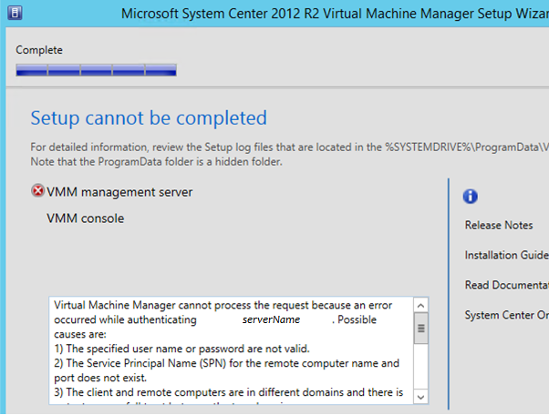

# HostAgentBadSharePathname error when you install System Center 2012 Virtual Machine Manager

This article discusses an issue in which you receive a HostAgentBadSharePathname error message when you try to install System Center 2012 Virtual Machine Manager.

_Original product version:_ &nbsp; Microsoft System Center 2012 R2 Virtual Machine Manager, System Center 2012 Virtual Machine Manager  
_Original KB number:_ &nbsp; 3004796

## Symptoms

When you try to install System Center 2012 Virtual Machine Manager (VMM 2012 R2 or VMM 2012), the installation fails and you receive an error message that resembles the following:

> Virtual Machine Manager cannot process the request because an error occurred while authenticating *Server-SCVMM-001.Contoso.com*. Possible causes are:
>
> 1. The specified user name or password are not valid.
> 2. The Service Principal Name (SPN) for the remote computer name and port does not exist.
> 3. The client and remote computers are in different domains and there is not a two-way full trust between the two domains.
>
> Log in by using an account on the same domain as the VMM management server, or by using an account on a domain that has a two-way full trust with the domain of the VMM management server, and then try the operation again. If this does not work, purge the Kerberos tickets on the VMM management server by using kerbtray.exe, available at [http://www.microsoft.com/en-us/download/details.aspx?id=17657](https://www.microsoft.com/download/details.aspx?id=17657). Then, reset the SPN for *Server-SCVMM-001.Contoso.com* by using setspn.exe. If this still does not fix the problem, make *Server-SCVMM-001.Contoso.com* a member of a workgroup instead of a domain, restart the computer, rejoin the domain, and then try the operation again.

> [!NOTE]  
> In this error message, *Server-SCVMM-001.Contoso.com* represents the actual server name. This error message is shown in the following screen shot.

Additionally, the following entry will be logged in the Installer (MSI) log (`%ProgramData%\VMMLogs\SetupWizard.log`):

> 10:30:07:FailureReason = Microsoft.VirtualManager.Setup.Exceptions.BackEndErrorException: Virtual Machine Manager cannot process the request because an error occurred while authenticating Server-SCVMM-001.Contoso.com. Possible causes are:
>
> 1) The specified user name or password are not valid.
> 2) The Service Principal Name (SPN) for the remote computer name and port does not exist.
> 3) The client and remote computers are in different domains and there is not a two-way full trust between the two domains.
>
> Log in by using an account on the same domain as the VMM management server, or by using an account on a domain that has a two-way full trust with the domain of the VMM management server, and then try the operation again. If this does not work, purge the Kerberos tickets on the VMM management server by using kerbtray.exe, available at [http://www.microsoft.com/en-us/download/details.aspx?id=17657](https://www.microsoft.com/download/details.aspx?id=17657). Then, reset the SPN for Server-SCVMM-001.Contoso.com by using setspn.exe. If this still does not fix the problem, make Server-SCVMM-001.Contoso.com a member of a workgroup instead of a domain, restart the computer, rejoin the domain, and then try the operation again.  
> ---> Microsoft.Carmine.WSManWrappers.WSManProviderException: Virtual Machine Manager cannot process the request because an error occurred while authenticating Server-SCVMM-001.Contoso.com. Possible causes are:
>
> 1) The specified user name or password are not valid.
> 2) The Service Principal Name (SPN) for the remote computer name and port does not exist.
> 3) The client and remote computers are in different domains and there is not a two-way full trust between the two domains.
>
> Log in by using an account on the same domain as the VMM management server, or by using an account on a domain that has a two-way full trust with the domain of the VMM management server, and then try the operation again. If this does not work, purge the Kerberos tickets on the VMM management server by using kerbtray.exe, available at [http://www.microsoft.com/en-us/download/details.aspx?id=17657](https://www.microsoft.com/download/details.aspx?id=17657). Then, reset the SPN for Server-SCVMM-001.Contoso.com by using setspn.exe. If this still does not fix the problem, make Server-SCVMM-001.Contoso.com a member of a workgroup instead of a domain, restart the computer, rejoin the domain, and then try the operation again.  
> ---> System.IO.FileNotFoundException: The network path was not found. at WSManAutomation.IWSManSession.Get(Object resourceUri, Int32 flags) at Microsoft.Carmine.WSManWrappers.MyIWSManSession.Get(Object resourceUri, Int32 flags) at Microsoft.Carmine.WSManWrappers.WsmanAPIWrapper.Get(MyWSManResourceLocator resLocator, WSManUri url, Type type, Boolean forceTypeCast) --- End of inner exception stack trace --- at Microsoft.Carmine.WSManWrappers.ErrorContextParameterHelper.ThrowTranslatedCarmineException(FileNotFoundException fioe) at Microsoft.Carmine.WSManWrappers.WsmanAPIWrapper.Get(MyWSManResourceLocator resLocator, WSManUri url, Type type, Boolean forceTypeCast) at Microsoft.Carmine.WSManWrappers.WsmanAPIWrapper.Get(WSManUri url, Type type, Boolean forceTypeCast) at Microsoft.Carmine.WSManWrappers.WSManCachedRequest\`1.Get(String url) at Microsoft.Carmine.VSImplementation.WindowsAgentHostFileInformation.Refresh() at Microsoft.Carmine.VSImplementation.HostFileInformation.GetHostFileInformation(WSManConnectionParameters connParams, String filename) at Microsoft.VirtualManager.Engine.ImageLibrary.ItemBase.RetrieveFileInfo(Boolean throwOnError, ErrorInfo& errorInfo) at Microsoft.VirtualManager.Engine.ImageLibrary.VHD.RetrieveFileInfo(Boolean throwOnError, ErrorInfo& errorInfo) at Microsoft.VirtualManager.Setup.DBConfigurator.AddLibVHD(String fullyQualifiedServerName, String libFolderName, String libFileName, Int64 fileSize, String libName, CarmineObjectAccessibility accessibility, String libDescription, VHDFormatType vhdFormatType, Guid serverGuid, Guid libraryShareID, Guid osId, VHDType vhdType, VirtualizationPlatform virtualizationPlatform) at Microsoft.VirtualManager.Setup.DBConfigurator.SetupAsLibServer(Nullable\`1 existingServerGuid) --- End of inner exception stack trace --- at Microsoft.VirtualManager.Setup.DBConfigurator.SetupAsLibServer(Nullable`1 existingServerGuid) at Microsoft.VirtualManager.Setup.VirtualMachineManagerHelpers.AddLibrary() at Microsoft.VirtualManager.Setup.InstallItemCustomDelegates.PangaeaServerPostinstallProcessor()  
> *** Carmine error was: HostAgentBadSharePathname (2917); HR: 0x80070035

The *Server-SCVMM-001.Contoso.com* server name also appears in a VMM debug log entry that resembles the following:

> WinRM: URL: [http://Servername.Contoso.com:5985], Verb: [GET], Resource: [http://schemas.microsoft.com/wbem/wsman/1/wmi/root/scvmm/FileInformation?Filename=\\\Server-SCVMM-001.Contoso.com\MSSCVMMLibrary\VHDs\Blank Disk - Small.vhd]

## Cause

This problem may occur if the name of the server contains the following characters:

**-SCVMM-**

This string is case-sensitive. Therefore, if the server name contains the same string in lowercase characters, or if it does not contain the two hyphen (-) characters, the setup program should not fail or generate this error.

> [!NOTE]  
> **-SCVMM-** is a reserved name within the Virtual Machine Manager product.

## Resolution

To resolve this problem, rename the server before you install System Center 2012 Virtual Machine Manager.

## More information

For more information about how to collect a VMM debug log, see the following Microsoft Knowledge Base article:

[2913445](https://support.microsoft.com/help/2913445) How to enable debug logging in Virtual Machine Manager
