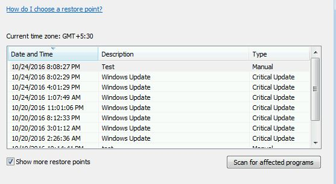

# System Restore points are disabled after you upgrade to Windows 10

This article discusses an issue where you can't restore the system to an earlier restore point after an upgrade to Windows 10.

_Original product version:_ &nbsp; Windows 10 - all editions  
_Original KB number:_ &nbsp; 3209726

## Symptoms

Assume that you have a Windows 7-based system with system restore points set, and the computer is upgraded to Windows 10. When you try to restore the system to an earlier restore point after the upgrade, you discover that you can't do that. The option is disabled. 

Windows 7 Disk Size:

:::image type="content" source="./media/system-restore-points-disabled/disk-size.jpg" alt-text="Screenshot of Windows 7 Disk Size.":::

Restore points on Windows 7: 

  

Restore points after you upgrade to Windows 10:

:::image type="content" source="./media/system-restore-points-disabled/restore-points-after-upgrade.jpg" alt-text="Screenshot of restore points after upgrade.":::

Querying the System Restore via PowerShell:  

  

## Cause

This issue occurs because system restore points don't persist after a Windows upgrade. This behavior is by design. 

## More information

By default, System Restore should be disabled after an upgrade regardless of its earlier setting, and all the older Restore Points will be deleted from System Restore. However, on an MSI or Windows Update installation, if the size of the operating system disk is greater than 128 gigabytes (GB), a restore point is automatically created without the user enabling System Restore (as if System Restore were already enabled). Similarly, if the disk size is less than 128 GB, no restore point is created until System Restore is manually enabled.

You can verify this yourself by checking for a restore point after an .msi or Windows Update installation on a computer that has a disk size of greater than 128 GB.

For more information about System Restore, see [How to Use System Restore in Windows 7, 8, and 10](https://support.microsoft.com/help/17085/windows-8-restore-refresh-reset-pc) and [Backup and restore in Windows 10](https://support.microsoft.com/instantanswers/62ed802d-7c8d-35d9-9b82-6cace4b08185/backup-and-restore-in-windows-10).
