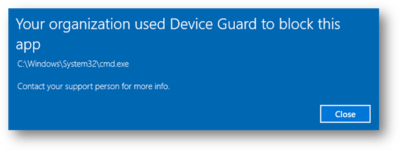

# Command prompt and PowerShell don't open after in-place upgrade of Windows 10 S

This article provides a solution to an issue where Command prompt and PowerShell don't open after in-place upgrade of Windows 10 S.

_Original product version:_ &nbsp; Windows 10, version 1809  
_Original KB number:_ &nbsp; 4019568

## Symptom

Windows 10 S can be upgraded to Windows 10 Pro, Windows 10 Enterprise, or Windows 10 Education by using various methods. For example:  

- Manually entering a product key  
- Using Microsoft Store for Business  
- Purchasing a license from the Microsoft Store  
- Using installation media (in-place upgrade)  

For more information, see Windows 10 edition upgrade [Windows 10 edition upgrade](https://docs.microsoft.com/windows/deployment/upgrade/windows-10-edition-upgrades).  
After you do an in-place upgrade of Windows 10 S by using Setup.exe from Windows 10 installation media, when you open a command prompt, PowerShell, or any Win32 application, you may receive the following error message:  
Your organization used Device Guard to block this app
C:\Windows\System32\cmd.exe

Contact your support person for more info.  

## Cause

This issue occurs because the policy that allows Windows 10 S to control Win32 applications has not cleared.  

## Resolution

To resolve this issue, restart the computer. You may have to restart two or three times to clear this policy.  

## Reference

For more information about what is blocked in Windows 10 S, see [Planning a Windows 10 in S mode deployment](https://docs.microsoft.com/windows-hardware/manufacture/desktop/windows-10-s-planning#what-is-blocked-in-windows-10-s).
