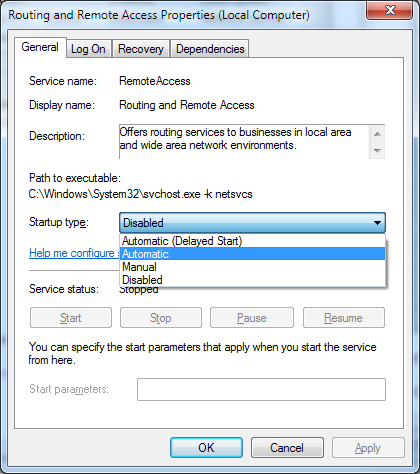

# "Error 1058" error message is displayed when a service suddenly stops

_Original product version:_ &nbsp; Microsoft Windows XP Home Edition, Microsoft Windows XP Professional, Windows Vista Business, Windows Vista Enterprise, Windows Vista Home Basic, Windows Vista Home Premium, Windows Vista Starter, Windows 7 Enterprise, Windows 7 Home Basic, Windows 7 Home Premium, Windows 7 Professional, Windows 7 Starter, Windows 7 Ultimate  
_Original KB number:_ &nbsp; 241584

## Symptoms

When a service suddenly stops, you may receive the following error message:Error 1058: The service cannot be started, either because it is disabled or because it has no enabled devices associated with it.
You may also receive this error message when you try to start a service.

This issue can occur if the service is disabled or if the service is disabled for the hardware profile that you are currently using.

## Resolution

To resolve this issue, follow the steps for your operating system.

Windows 7 and Windows Vista

1. Click Start , type Services in the Search box, and then click Services .
2. Scroll until you find the service that is stopped or disabled.
3. Click the Log On As tab.
4. If the service is listed as disabled for your profile, right-click the service, and then click Properties .

5. Click the Startup type list, and then click Automatic .
6. Click Apply , and then click OK .

Windows XP

1. Click Start , point to All Programs , point to Administrative Tools , and then click Services .
2. Scroll until you find the service that is stopped or disabled.
3. Double-click the service that did not start.
4. Click the Log On tab.

5. Verify that the service is not disabled for the hardware profile that you are using. If the service is disabled for the hardware profile, click Enable .
6. Click the General tab, and then in the **Startup Type box**, verify that the service is not disabled. If the service is disabled, click Automatic to have it start when you start the computer.

7. Click OK .

## More Information

If a service is set to start automatically but the service is disabled for the hardware profile that you are using, the service is not started and no error message is generated.

This article applies to Windows 2000. Support for Windows 2000 ended on July 13, 2010. The [Windows 2000 End-of-Support Solution Center](/win2000) is a starting point for planning your migration strategy from Windows 2000. For more information, see the [Microsoft Support Lifecycle Policy](/lifecycle/).
