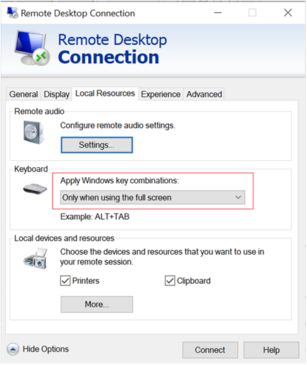

# Local computer behaves as if the Windows logo key is pressed after you switch from a Remote Desktop session

_Original product version:_ &nbsp; Windows 10, version 2004, all editions, Windows Server, version 2004, all editions, Windows 10, version 1909, all editions, Windows Server, version 1903, all editions, Windows 10, version 1903, all editions, Windows Server 2019, all editions, Windows Server 2016, Windows 10, Windows Server 2012 R2, Windows 8.1, Windows Server 2012, Windows 8, Windows Server 2008 R2, Windows 7, Windows Server 2008  
_Original KB number:_ &nbsp; 4467266

## Symptoms

After you start a Remote Desktop Protocol (RDP) session to a remote computer, your local computer behaves as if you are always pressing and holding the Windows logo key. For example, when you press **R**, the **Run** box opens. When you press **E**, File Explorer starts.

## Cause

This issue occurs if you use particular settings for your Remote Desktop connection and you take the following steps:
1. Before you connect to the remote computer, open the **Local Resources** tab of the **Remote Desktop Connection** dialog box, and set **Apply Windows key combinations**  to either **On the remote computer**  or **Only when using the full screen**.

2. To start the Remote Desktop session, select **Connect**.
3. If you selected **Only when using the full screen** in step 1, expand the Remote Desktop session window to full screen. If you selected **On the remote computer**, go to step 4.
4. Do the following key sequence:
  1. Press and hold the **L** key.
  2. Press and hold the Windows logo key.
  3. Release the **L** key.
  4. Release the Windows logo key.
5. Disconnect the Remote Desktop session, or switch from the Remote Desktop session window to a window on the local computer.

## Workaround

To work around this issue, press and release the Windows logo key again after you return to the local computer.
