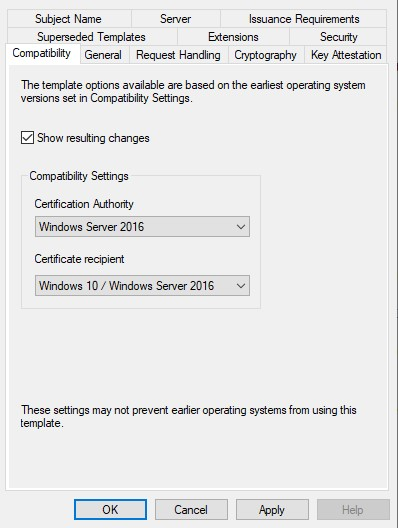

# Cannot select Windows Server 2016 CA-compatible certificate templates from Windows Server 2016 or later-based CAs or CEP servers

This article provides a workaround for the issue Windows Server 2016 CA-compatible certificate templates cannot be selected from Windows Server 2016 or later-based CAs or CEP servers.

_Original product version:_ &nbsp; Windows Server 2019, Windows Server 2016  
_Original KB number:_ &nbsp; 4508802

## Symptoms

Consider either of the following scenarios:

- You configure a Windows Server 2016-based certificate enrollment policy (CEP) server or certificate enrollment server (CES).
- You install a new Windows Server 2016 Certification Authority (CA).
- You configure the compatibility settings of a certificate template by setting **Certification Authority** to **Windows Server 2016** and **Certificate recipient** to **Windows 10 / Windows Server 2016**.

    

When Windows 10 users try to request certificates by using the CA Web enrollment page (the CEP URL), the certificate template that you configured as described here is not listed as an available template.

## Cause

This is a known issue in Windows Server 2016 and later versions. The CEP or CES server provides certificate templates only to clients that have the following compatibility settings:

- **Certification Authority**: Windows Server 2012 R2 or an earlier version
- **Certificate recipient**: Windows 8.1 (or an earlier version) and Windows Server 2012 R2 (or an earlier version)

## Workaround

To work around this issue, follow these steps:

1. Configure the compatibility settings of the certificate template as follows:
   - **Certificate Authority**: **Windows Server 2012 R2**  
   - **Certificate recipient**: **Windows 8.1 / Windows Server 2012 R2**  

    

2. Wait 30 minutes for the CEP server to receive the updated template information (or use the IISReset tool to restart the server).
3. On the client computer, clear the client-side Enrollment Policy Cache by using the following command in a Command Prompt window:

    ```console
     certutil -f -policyserver * -policycache delete
    ```
  
4. On the client computer, try to enroll the certificate again. The template should now be available.
