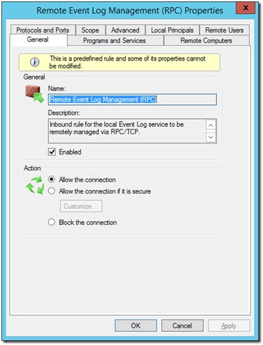
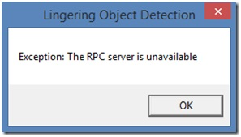
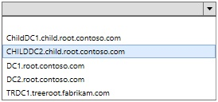
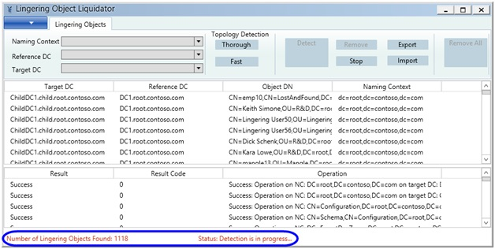
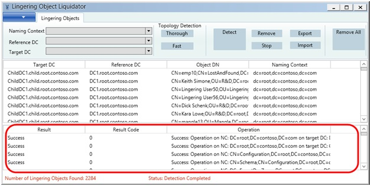
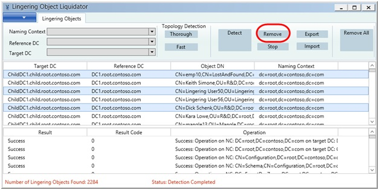
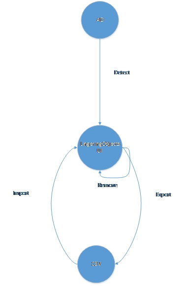

# Description of the Lingering Object Liquidator tool

This article describes the Lingering Object Liquidator (LoL) tool for finding and removing lingering objects.

_Original product version:_ &nbsp; Windows Server 2012 R2  
_Original KB number:_ &nbsp; 3141939

## Introduction

The [Lingering Object Liquidator](https://techcommunity.microsoft.com/t5/ask-the-directory-services-team/introducing-lingering-object-liquidator-v2/ba-p/400475) (LOL) is a tool to automate the discovery and removal of lingering objects. The tool uses the DRSReplicaVerifyObjects method, which is leveraged by the `repadmin /removelingeringobjects` command and the repldiag tool in combination with the removeLingeringObject  rootDSE primitive that's used by LDP.EXE.

### Benefits and availability

- Combines discovery and removal of lingering objects in one interface.
- The tool is available from the [Microsoft download center](https://aka.ms/MSFTLoL).

See this ASKDS [blog post](https://aka.ms/LingeringObjectLiquidator) for detailed instructions on tool usage.

### Key features

- Removes all the lingering objects across all domain controllers (DCs) without any prompting.
- Performs an (n * (n-1)) comparison across every DC in the forest.
- Performs topology detection, which lets you pick and choose DCs to use for Lingering object comparison (source and target).
- Exports a list of lingering objects as a CSV file, so that it can be edited offline and then imported back into the tool to remove the objects if necessary (useful for advanced removal operations).
- Saves the contents of the object in a log file in case a new object must be hydrated from the lingering object.  

### Tools requirements

- Download and run Lingering Object Liquidator on a DC or member computer in the forest you want to remove lingering objects from.
- The Microsoft .NET Framework 4.5.2 must be installed on the computer that's running the tool.
- Permissions: The user account running the tool must have Domain Administrator credentials for each domain in the forest that the executing computer resides in. Members of the Enterprise Administrators group have domain administrator credentials in all domains within a forest by default. Domain Administrator credentials are sufficient in a single domain or a single domain forest.
- You must enable the Remote Event Log Management (RPC) firewall rule on any DC that needs scanning. Otherwise, the tool returns an "Exception: The RPC server is unavailable" error.

    | | |
    |---|---|
    |||

- The liquidation of lingering objects in Active Directory Lightweight Directory Services (AD LDS / ADAM) environments isn't supported.  

### Walkthrough

#### Lingering object detection

Run the tool as a domain administrator (or as an Enterprise administrator if you want to scan the entire forest). To do this follow these steps.

> [!NOTE]
> You will receive error 8453 if the tool isn't run as elevated.

 

1. In the Topology Detection section, select Fast.

    Fast detection populates the Naming Context, Reference DC, and Target DC lists by querying the local DC. *Thorough* detection does a more exhaustive search of all DCs and leverages DC Locator and DSBind  calls. Be aware that Thorough detection will likely fail if one or more DCs are unreachable.

2. The following are the fields on the Lingering Objects tab:

    Naming Context  

     

    Reference DC  

    This is the DC you'll compare to the target DC. The reference DC hosts a writeable copy of the partition.

     

    > [!NOTE]
    > All DCs in the forest are displayed even if they are unsuitable as reference DCs (ChildDC2 is an RODC and is not a valid Reference DC since it doesn't host a writable copy of a DC).

    Target DC  

    The target DC that lingering objects are to be removed from.

     

3. Click Detect to use these DCs for the comparison or leave all fields blank to scan the entire environment.

    The tool does a comparison with all DCs for all partitions in a pair-wise fashion when all fields are left blank. In a large environment, this comparison will take a great deal of time (possibly even days) as the operation targets (n * (n-1)) number of DCs in the forest for all locally held partitions. For shorter, targeted operations, select a naming context, reference DC, and target DC. The reference DC must hold a writable copy of the selected naming context. Be aware that clicking Stop doesn't actually stop the server-side API, it just stops the work in the client-side tool.

     

    During the scan, several buttons are disabled, and the current count of lingering objects is displayed on the status bar at the bottom of the screen, together with the current tool status. During this execution phase, the tool is running in an advisory mode and reading the event log data that's reported on each target DC.

     

    When the scan is complete, the status bar updates, buttons are re-enabled, and total count of lingering objects is displayed. The Results pane at the bottom of the window updates with any errors encountered during the scan.

    If you see error 1396 or error 8440 in the status pane, you're using an early beta-preview version of the tool and should update to the latest version.
       - Error 1396 is logged if the tool incorrectly used an RODC as a reference DC.
       - Error 8440 is logged when the targeted reference DC doesn't host a writable copy of the partition.

    Notes about the Lingering Object Liquidator discovery method  
      - Leverages DRSReplicaVerifyObjects method in Advisory Mode.
      - Runs for all DCs and all partitions.
      - Collects lingering object event ID 1946 and displays objects in main content pane.
      - List can be exported to CSV for offline analysis (or modification for import).
      - Supports import and removal of objects from CSV import (leverage for objects not discoverable using DRSReplicaVerifyObjects).
      - Supports removal of objects by DRSReplicaVerifyObjects and LDAP rootDSE removeLingeringobjects modification.

    The tool leverages the Advisory Mode method exposed by DRSReplicaVerifyObjects that both `repadmin /removelingeringobjects /Advisory_Mode` and `repldiag /removelingeringobjects` use. In addition to the normal Advisory Mode-related events logged on each DC, it displays each of the lingering objects within the main content pane.

    

    Results of the scan are logged in the Results pane. Many more details of all operations are logged in the linger\<Date-TimeStamp>.log.txt file in the same directory as the tool's executable.

    The Export button allows you to export a list of all lingering objects listed in the main pane into a CSV file. View the file in Excel, modify if necessary and use the Import button later to view the objects without having to do a new scan. The Import feature is also useful if you discover abandoned objects (not discoverable with DRSReplicaVerifyObjects) that you need to remove.

    A note about transient lingering objects:

    Garbage collection is an independent process that runs on each DC every 12 hours by default. One of its jobs is to remove objects that have been deleted and have existed as a tombstone for greater than the tombstone lifetime number of days. There's a rolling 12-hour period where an object eligible for garbage collection exists on some DCs but has already been removed by the garbage collection process on other DCs. These objects will also be reported as lingering object by the tool, however no action is required as they'll automatically get removed the next time the garbage collector process runs on the DC.

4. To remove individual objects, select a single object or multi-select multiple objects by using the Ctrl or Shift key. Press Ctrl to select multiple objects, or Shift to select a range of objects and then select **Remove**.
    

    

    The status bar is updated with the new count of lingering objects and the status of the removal operation:

     

    The tool dumps a list of attributes for each object before removal and logs this along with the results of the object removal in the removedLingeringObjects.log.txt log file. This log file is in the same location as the tool's executable.
     C:\tools\LingeringObjects\removedLingeringObjects<DATE-TIMEStamp.log.txt

    Example contents of the log file:

    > the obj DN: <GUID=0bb376aa1c82a348997e5187ff012f4a>;  <SID=010500000000000515000000609701d7b0ce8f6a3e529d669f040000>;CN=Dick Schenk,OU=R&D,DC=root,DC=contoso,DC=com  
    objectClass:top, person, organizationalPerson, user;  
    sn:Schenk;  
    whenCreated:20121126224220.0Z;  
    name:Dick Schenk;  
    objectSid:S-1-5-21-3607205728-1787809456-1721586238-1183;primaryGroupID:513;  
    sAMAccountType:805306368;  
    uSNChanged:32958;  
    objectCategory:<GUID=11ba1167b1b0af429187547c7d089c61>;CN=Person,CN=Schema,CN=Configuration,DC=root,DC=contoso,DC=com;  
    whenChanged:20121126224322.0Z;  
    cn:Dick Schenk;  
    uSNCreated:32958;  
    l:Boulder;  
    distinguishedName:<GUID=0bb376aa1c82a348997e5187ff012f4a>;  <SID=010500000000000515000000609701d7b0ce8f6a3e529d669f040000>;CN=Dick Schenk,OU=R&D,DC=root,DC=contoso,DC=com;  
    displayName:Dick Schenk;  
    st:Colorado;  
    dSCorePropagationData:16010101000000.0Z;  
    userPrincipalName:Dick@root.contoso.com;  
    givenName:Dick;  
    instanceType:0;  
    sAMAccountName:Dick;  
    userAccountControl:650;  
    objectGUID:aa76b30b-821c-48a3-997e-5187ff012f4a;  
    value is   :<GUID=70ff33ce-2f41-4bf4-b7ca-7fa71d4ca13e>:<GUID=aa76b30b-821c-48a3-997e-5187ff012f4a>
    Lingering Obj CN=Dick Schenk,OU=R&D,DC=root,DC=contoso,DC=com is removed from the directory, mod response result code = Success  
    \---------------------------------------------  
    RemoveLingeringObject returned Success

    After all objects are identified, they can be bulk-removed by selecting all objects and then Remove, or exported into a CSV file. The CSV file can later be imported again to do bulk removal. Be aware that there's a Remove All  button that leverages the `repadmin /removelingeringobject` method of lingering object removal

**Support:** While this tool has been thoroughly tested in many environments, it's provided to you **as-is**: There will be no official Microsoft support provided.

 **For questions or feedback on the tool:**  

Add a comment to this [blog post](https://aka.ms/LingeringObjectLiquidator), or submit an idea to our [UserVoice](https://windowsserver.uservoice.com/forums/304621-active-directory) Feedback page--ensure you code the idea using the "Lingering Object Liquidator" category.

Access the [Troubleshooting Active Directory Lingering Objects](https://support.microsoft.com/help/910205) TechNet Virtual Lab if you would like practice using this tool in a lab environment containing lingering objects.

### Workflow

## More information

| Removal method| Object / Partition & and Removal Capabilities| Details |
|---|---|---|
| Lingering Object Liquidator|Per-object and per-partition removal  Leverages: - RemoveLingeringObjects LDAP rootDSE modification - DRSReplicaVerifyObjects method| - GUI-based - Quickly displays all lingering objects in the forest to which the executing computer is joined - Built-in discovery through the DRSReplicaVerifyObjects method - Automated method to remove lingering objects from all partitions - Removes lingering objects from all DCs (including RODCs) but not lingering links - Windows Server 2008 and later DCs (will not work against Windows Server 2003 DCs)|
| Repldiag /removelingeringobjects|Per-partition removal  Leverages: - DRSReplicaVerifyObjects method| - Command line only - Automated method to remove lingering objects from all partitions - Built-in discovery through DRSReplicaVerifyObjects  - Displays discovered objects in events on DCs - Doesn't remove lingering links. Doesn't remove lingering objects from RODCs (yet).|
| LDAP RemoveLingeringObjects rootDSE primitive (most commonly executed using LDP.EXE or an LDIFDE import script)|Per-object removal| - Requires a separate discovery method - Removes a single object per execution unless scripted.|
| Repadmin /removelingeringobjects|Per-partition removal  Leverages: - DRSReplicaVerifyObjects method| - Command line only - Built-in discovery through DRSReplicaVerifyObjects  - Displays discovered objects in events on DCs - Requires many executions if a comprehensive (n * (n-1)) pairwise cleanup is required.  The repldiag tool and the Lingering Object Liquidator tool automate this task. |
||||
